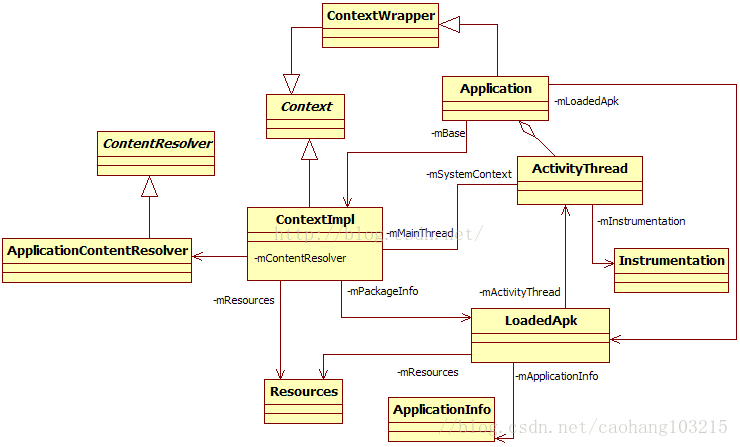
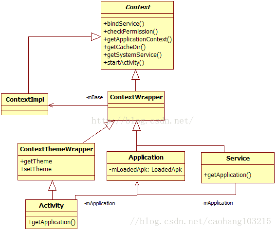

# 0.概述
AMS是Android中`最核心的服务`，主要负责系统中`四大组件的启动`、`切换`、`调度`及`应用进程的管理和调度`等工作，其职责与操作系统中的进程管理和调度模块相类似，因此它在Android中非常重要。

<!--more-->

* `ActivityManagerService extends ActivityManagerNative implements Watchdog.Monitor, BatteryStatsImpl.BatteryCallback`
* 客户端使用ActivityManager类。由于AMS是系统核心服务，很多API不能开放供客户端使用，所以设计者没有让ActivityManager直接加入AMS家族。在ActivityManager类内部通过调用AMN的getDefault函数得到一个ActivityManagerProxy对象，通过它可与AMS通信。

# 1.AMS启动

AMS由SystemServer的ServerThread线程创建，提取它的调用轨迹，代码如下：

```java
//path:SystemServer.java::initAndLoop()
//1.Boolean:factoryTest SystemProperties.get("ro.factorytest");是否厂测
Context context=ActivityManagerService.main(factoryTest);
//2.setSystemProcess：这样SystemServer进程可加到AMS中，并被它管理
ActivityManagerService.setSystemProcess();
//3.installSystemProviders：将SettingsProvider放到SystemServer进程中来运行
ActivityManagerService.installSystemProviders();
//4.在内部保存WindowManagerService（以后简称WMS）
ActivityManagerService.self().setWindowManager(wm);
//5.AMS是系统的核心，只有它准备好后，才能调用其他服务的systemReady,少量之前那完成。
 ActivityManagerService.self().systemReady(new Runnable() {
     public void run() {
       Slog.i(TAG, "Making services ready");
       ActivityManagerService.self().startObservingNativeCrashes();
      // 如此，状态栏就准备好了
      //SystemUIService由SystemUi.apk提供，它实现了系统的状态栏。
       if (!headless) startSystemUi(contextF);
       if (mountServiceF != null) mountServiceF.systemReady();
       if (batteryF != null) batteryF.systemReady();
       if (networkManagementF != null) networkManagementF.systemReady();
       if (networkStatsF != null) networkStatsF.systemReady();
       if (networkPolicyF != null) networkPolicyF.systemReady();
       if (connectivityF != null) connectivityF.systemReady();
       if (dockF != null) dockF.systemReady();
       if (usbF != null) usbF.systemReady();
       if (twilightF != null) twilightF.systemReady();
       if (uiModeF != null) uiModeF.systemReady();
       if (recognitionF != null) recognitionF.systemReady();
       Watchdog.getInstance().start();
      // TODO:It is now okay to let the various system services start their third party code...
       if (appWidgetF != null) appWidgetF.systemRunning(safeMode);
       if (wallpaperF != null) wallpaperF.systemRunning();
       if (immF != null) immF.systemRunning(statusBarF);     
       if (locationF != null) locationF.systemRunning();
       if (countryDetectorF != null) countryDetectorF.systemRunning();
       if (networkTimeUpdaterF != null) networkTimeUpdaterF.systemRunning();
       if (commonTimeMgmtServiceF != null) commonTimeMgmtServiceF.systemRunning();
        ...
       // For debug builds, log event loop stalls to dropbox for analysis.
        if (StrictMode.conditionallyEnableDebugLogging()) {
            Slog.i(TAG, "Enabled StrictMode for system server main thread.");
        }
        Looper.loop();
        Slog.d(TAG, "System ServerThread is exiting!");
}
```
将分析除了4外的掉用。

## 1.1 ActivityManagerService.main
AMS的main函数将返回一个`Context`类型的对象，该对象在SystemServer中被其他服务大量使用。`Context`，顾名思义，代表了一种上下文环境，有了这个环境，我们就可以做很多事情（例如获取该环境中的资源、Java类信息等）。

```java
//ActivityManagerService.java
public static final Context main(int factoryTest) {
    //线程中完成：
    //1.ActivityManagerService m = new ActivityManagerService();
    //mService = m;通知实例好了，则thr.mService!=null
    AThread thr = new AThread();
    thr.start();
    while (thr.mService == null) thr.wait();//收到通知，继续
    ActivityManagerService m = thr.mService;
    mSelf = m;
    //2.ActivityThread它代表一个应用进程的主线程，其职责就是调度及执行在该线程中运行的四大组件。
    ActivityThread at = ActivityThread.systemMain();
    mSystemThread = at;
    //3.接口获取并操作Application对应的资源、类，甚至包含于Application中的四大组件。
    Context context = at.getSystemContext();
    context.setTheme(android.R.style.Theme_Holo);
    m.mContext = context;
    m.mFactoryTest = factoryTest;
    m.mIntentFirewall = new IntentFirewall(m.new IntentFirewallInterface());
    //AMS中用来管理Activity的启动和调度的核心类
    m.mStackSupervisor = new ActivityStackSupervisor(m, context, thr.mLooper);
    m.mBatteryStatsService.publish(context);
    m.mUsageStatsService.publish(context);
    m.mAppOpsService.publish(context);
    thr.mReady = true;
    thr.notifyAll();
    //4.启动startRunning函数
    m.startRunning(null, null, null, null);
    return context;
}
```
在main函数中，完成mSystemThread等全局变量填充和调用了startRunning函数.。主要分析`ActivityManagerService`构造函数。 
和几个全局变量。

### 1.1.1 AMS构造函数

AMS的构造函数的代码如下

```java
private ActivityManagerService() {
	//创建广播队列(前台和后台队列)
	mFgBroadcastQueue = new BroadcastQueue(this, "foreground", BROADCAST_FG_TIMEOUT, false);
	mBgBroadcastQueue = new BroadcastQueue(this, "background", BROADCAST_BG_TIMEOUT, true);
	 mBroadcastQueues[0] = mFgBroadcastQueue;
	 mBroadcastQueues[1] = mBgBroadcastQueue;
	//service和provider
	 mServices = new ActiveServices(this);
	 mProviderMap = new ProviderMap(this);
	//创建/data/system/
	 File dataDir = Environment.getDataDirectory();
	 File systemDir = new File(dataDir, "system");
	 systemDir.mkdirs();
	 // 电源服务一些信息/data/system/batterystats.bin
	 mBatteryStatsService = new BatteryStatsService(new File(
	         systemDir, "batterystats.bin").toString());
	 mBatteryStatsService.getActiveStatistics().readLocked();
	 mBatteryStatsService.getActiveStatistics().writeAsyncLocked();
	 mOnBattery = DEBUG_POWER ? true
	         : mBatteryStatsService.getActiveStatistics().getIsOnBattery();
	 mBatteryStatsService.getActiveStatistics().setCallback(this);
	//进程状态 /data/system/procstates
	 mProcessStats = new ProcessStatsService(this, new File(systemDir, "procstats"));
	 //使用状态 /data/system/usagestats
	mUsageStatsService = new UsageStatsService(new File(systemDir, "usagestats").toString());
	// Ops状态 /data/system/appops.xml
	 mAppOpsService = new AppOpsService(new File(systemDir, "appops.xml"));
	// Uri授权记录 /data/system/urigrants.xml
	 mGrantFile = new AtomicFile(new File(systemDir, "urigrants.xml"));
	
	 mHeadless = "1".equals(SystemProperties.get("ro.config.headless", "0"));
	
	 // User 0 is the first and only user that runs at boot.
	 mStartedUsers.put(0, new UserStartedState(new UserHandle(0), true));
	 mUserLru.add(Integer.valueOf(0));
	 updateStartedUserArrayLocked();
	
	 GL_ES_VERSION = SystemProperties.getInt("ro.opengles.version",
	     ConfigurationInfo.GL_ES_VERSION_UNDEFINED);
	//mConfiguration类型为Configuration，用于描述资源文件的配置属性，
	//例如字体、语言等。后文再讨论这方面的内容
	 mConfiguration.setToDefaults();
	 mConfiguration.setLocale(Locale.getDefault());
	
	 mConfigurationSeq = mConfiguration.seq = 1;
	 mProcessCpuTracker.init();
	
	 mCompatModePackages = new CompatModePackages(this, systemDir);
	
	 // Add ourself to the Watchdog monitors.
	 Watchdog.getInstance().addMonitor(this);
	
	 mProcessCpuThread = new Thread("CpuTracker"){
	     @Override
	     public void run() {
	         while (true) {
	             final long now = SystemClock.uptimeMillis();
	             long nextCpuDelay =(mLastCpuTime.get()+MONITOR_CPU_MAX_TIME)-now;
	              long nextWriteDelay = (mLastWriteTime+BATTERY_STATS_TIME)-now;
	              //Slog.i(TAG, "Cpu delay=" + nextCpuDelay
	               //        + ", write delay=" + nextWriteDelay);
	              if (nextWriteDelay < nextCpuDelay) {
	                    nextCpuDelay = nextWriteDelay;
	                }
	                         if (nextCpuDelay > 0) {
	                             mProcessCpuMutexFree.set(true);
	                             this.wait(nextCpuDelay);
	                         }
	                 updateCpuStatsNow();
	         }
	        }
	 };
	 mProcessCpuThread.start();
}
```

构造函数完成了：

* 建立了`mFgBroadcastQueue`和`mBgBroadcastQueue`两个广播队列。
* `ActiveServices`和`providermap`
* 建立`/data/system/`目录下一些信息，如：`/data/system/procstates`等一些配置信息初始化：字体，语言，等启动线程，cpu一些使用情况。

### 1.1.2 AT.systemMain
**注意**:应用进程指那些运行APK的进程，它们由Zyote 派生（fork）而来，上面运行了dalvik虚拟机。与应用进程相对的就是系统进程（包括Zygote和SystemServer）。

**应用进程和系统进程**与**应用APK和系统APK**的概念区分开来。APK的判别依赖其文件所在位置（如果apk文件在`/data/app`目录下，则为应用APK）。

```java
public static ActivityThread systemMain() {
   //禁止硬件加速
   HardwareRenderer.disable(true);
   ActivityThread thread = new ActivityThread();
   thread.attach(true);
   return thread;
}
```

前面所说的`ActivityThread`代表应用进程（其上运行了APK）的主线程，而SystemServer并非一个应用进程，那么为什么此处也需要ActivityThread呢？

* 还记得在PackageManagerService分析中提到的`framework-res.apk`吗？这个APK除了包含资源文件外，还包含一些Activity（如`关机对话框`），这些`Activity`实际上运行在`SystemServer`进程中。从这个角度看，SystemServer是一个特殊的应用进程。
* 另外，通过ActivityThread可以把Android系统提供的组件之间的交互机制和交互接口（如利用Context提供的API）也拓展到SystemServer中使用。

```java
//system=true
private void attach(boolean system) {
    sCurrentActivityThread = this;
    mSystemThread = system;
    if (!system) {//应用进程处理流程
        ViewRootImpl.addFirstDrawHandler(new Runnable() {
            @Override
            public void run() {
                ensureJitEnabled();
            }
        });
        android.ddm.DdmHandleAppName.setAppName("<pre-initialized>",UserHandle.myUserId());
        RuntimeInit.setApplicationObject(mAppThread.asBinder());
        IActivityManager mgr = ActivityManagerNative.getDefault();
        try {
            mgr.attachApplication(mAppThread);
        } catch (RemoteException ex) {
            // Ignore
        }
    } else {//系统处理流程，systemServer中对应这个.
        // Don't set application object here -- if the system crashes,
        // we can't display an alert, we just want to die die die.
        //设置DDMS看到systemserver进程名为system_process
        android.ddm.DdmHandleAppName.setAppName("system_process",
                                                UserHandle.myUserId());
        try {//Activity几员大将出场
            mInstrumentation = new Instrumentation();
            ContextImpl context = new ContextImpl();
            context.init(getSystemContext().mPackageInfo, null, this);
            Application app = Instrumentation.newApplication(Application.class, context);
            //一个进程支持多个应用
            mAllApplications.add(app);
            mInitialApplication = app;
            app.onCreate();
        } catch (Exception e) {
            throw new RuntimeException(
                    "Unable to instantiate Application():" + e.toString(), e);
        }
    }

    // add dropbox logging to libcore
    DropBox.setReporter(new DropBoxReporter());
    //监听配置改变，如语言切换时，需要调用。
    ViewRootImpl.addConfigCallback(new ComponentCallbacks2() {
        @Override
        public void onConfigurationChanged(Configuration newConfig) {
            synchronized (mResourcesManager) {
                // We need to apply this change to the resources
                // immediately, because upon returning the view
                // hierarchy will be informed about it.
                if (mResourcesManager.applyConfigurationToResourcesLocked(newConfig, null)) {
                    // This actually changed the resources!  Tell
                    // everyone about it.
                    if (mPendingConfiguration == null ||
                            mPendingConfiguration.isOtherSeqNewer(newConfig)) {
                        mPendingConfiguration = newConfig;

                        sendMessage(H.CONFIGURATION_CHANGED, newConfig);
                    }
                }
            }
        }
        @Override
        public void onLowMemory() {
        }
        @Override
        public void onTrimMemory(int level) {
        }
    });
}
```
Activity几员大将出场：
* `Instrumentation`:一个工具类。当它被启用时，系统先创建它，再通过它来创建其他组件。系统和组件之间的交互也将通过`Instrumentation`来传递，这样，Instrumentation就能监测系统和这些组件的交互情况了。在实际使用中，我们可以创建Instrumentation的派生类来进行相应的处理。
* `Application`:保存了一个全局的application状态。Application由AndroidManifest.xml中的`<application>`标签声明。在实际使用时需定义Application的派生类。Application是Android中的一个概念，可理解为一种容器，它内部包含四大组件。另外，一个进程可以运行多个Application。
* `Context`是一个接口，通过它可以获取并操作Application对应的资源、类，甚至包含于Application中的四大组件。Context是一个抽象类，而由AMS创建的将是它的子类ContextImpl。

### 1.1.3 at.getSystemContext()

```java
public ContextImpl getSystemContext() {
    synchronized (this) {
        if (mSystemContext == null) {
            ContextImpl context =
                ContextImpl.createSystemContext(this);
            //LoadedApk代表一个加载到系统中的APK
            LoadedApk info = new LoadedApk(this, "android", context, null,
                    CompatibilityInfo.DEFAULT_COMPATIBILITY_INFO);
            context.init(info, null, this);
             //初始化资源信息
            context.getResources().updateConfiguration
            (mResourcesManager.getConfiguration(),
            getDisplayMetricsLocked(Display.DEFAULT_DISPLAY));
            mSystemContext = context;
            //Slog.i(TAG, "Created system resources " + context.getResources()
            //        + ": " + context.getResources().getConfiguration());
        }
    }
    return mSystemContext;
}
```
为什么函数名是getSystemContext呢？

* 初始化ContextImp时使用了一个`LoadedApk`对象,package名为`android`,其实就是framework-res.apk,为了加载该APK。 



上述类中关系图：

* 先来看派生关系,`ApplicationContentResolver`从`ConentResolver`派生，它主要用于和ContentProvider打交道。ContextImpl和ContextWrapper均从Context继承，而`Application`则从`ContextWrapper`派生。
* 从社会关系角度看，ContextImpl交际面最广。它通过mResources指向Resources，mPackageInfo指向LoadedApk，mMainThread指向ActivityThread，mContentResolver指向ApplicationContentResolver。

对Context进行再议：



由图可知:

* `ContextWrapper`是一个代理类，被代理的对象是另外一个Context。被代理的类其实是ContextImpl，由ContextWrapper通过mBase成员变量指定。其内部函数功能的实现最终都由mBase完成。这样设计的目的是想把ContextImpl隐藏起来。
* Application从ContextWrapper派生，并实现了ComponentCallbacks2接口。Application中有一个LoadedApk类型的成员变量mLoadedApk。**LoadedApk代表一个APK文件**。由于一个AndroidManifest.xml文件只能声明一个Application标签，所以一个Application必然会和一个LoadedApk绑定。
* Service从ContextWrapper派生，其中Service内部成员变量mApplication指向Application（在AndroidManifest.xml中，Service只能作为Application的子标签，所以在代码中Service必然会和一个Application绑定）。
* ContextThemeWrapper重载了和Theme（主题）相关的两个函数。这些和界面有关，所以Activity作为Android系统中的UI容器，必然也会从ContextThemeWrapper派生。与Service一样，Activity内部也通过mApplication成员变量指向Application。

**systemMain函数总结**

* 得到一个ActivityThread对象，它代表应用进程的主线程。
* 得到一个Context对象，它背后所指向的Application环境与framework-res.apk有关。

**systemMain函数将为SystemServer进程搭建一个和应用进程一样的Android运行环境**。这句话涉及两个概念。  

* `进程`：来源于操作系统，是在OS中看到的运行体。我们编写的代码一定要运行在一个进程中。
* `Android运行环境`：Android努力构筑了一个自己的运行环境。在这个环境中，进程的概念被模糊化了。组件的运行及它们之间的交互均在该环境中实现。

Android运行环境是构建在进程之上的。在应用程序中，一般只和Android运行环境交互。基于同样的道理，SystemServer希望它内部的那些Service也通过Android运行环境交互，因此也需为它创建一个运行环境。由于SystemServer的特殊性，此处调用了systemMain函数，而普通的应用进程将在主线程中调用ActivityThread的main函数来创建Android运行环境。

另外，ActivityThread虽然本意是代表进程的主线程，但是作为一个Java类，它的实例到底由什么线程创建，恐怕不是ActivityThread自己能做主的，所以在SystemServer中可以发现，ActivityThread对象由其他线程创建，而在应用进程中，ActivityThread将由主线程来创建。

### 1.1.4 m.startRunning

```java
public final void startRunning(String pkg, String cls, String action, String data) {
synchronized(this) {
        if (mStartRunning) {
            return;
        }
        mStartRunning = true;
        //mTopComponent最终赋值为null
        mTopComponent = pkg != null && cls != null
                ? new ComponentName(pkg, cls) : null;
        //mTopAction= Intent.ACTION_MAIN
        mTopAction = action != null ? action : Intent.ACTION_MAIN;
        mTopData = data;//mTopData最终为null
        if (!mSystemReady) {
            return;
        }
    }
    //这个函数很重要，可惜不在本次startRunning中调用
    systemReady(null);
}
```

## 1.2 AMS.setSystemProcess

```java
public static void setSystemProcess() {
    try {
        ActivityManagerService m = mSelf;
        //向ServiceManager注册几个服务
        ServiceManager.addService(Context.ACTIVITY_SERVICE, m, true);
        ServiceManager.addService(ProcessStats.SERVICE_NAME, m.mProcessStats);
        ServiceManager.addService("meminfo", new MemBinder(m));
        ServiceManager.addService("gfxinfo", new GraphicsBinder(m));//显示加速方面的信息（Applications
         Graphics Acceleration Info）， dumpsys gfxinfo
        ServiceManager.addService("dbinfo", new DbBinder(m));
        if (MONITOR_CPU_USAGE) {
            ServiceManager.addService("cpuinfo", new CpuBinder(m));
        }
        //向SM注册权限管理服务PermissionController
        ServiceManager.addService("permission", new PermissionController(m));
        //虽然PKMS和AMS同属一个进程，但是二者交互仍然借助Context 其实，此处完全可以直接调用PKMS的函数。为什么要费如此周折呢   
        ApplicationInfo info =
            mSelf.mContext.getPackageManager().getApplicationInfo(
                        "android", STOCK_PM_FLAGS);
        //1.installSystemApplicationInfo
        mSystemThread.installSystemApplicationInfo(info);
        synchronized (mSelf) {//2.此处涉及AMS对进程的管理,processName=system
            ProcessRecord app = mSelf.newProcessRecordLocked(info,
                    info.processName, false);
            //这里标识出systemProcess
            app.persistent = true;//设置该值为true
            app.pid = MY_PID;//设置pid为SystemServer的进程号
            app.maxAdj = ProcessList.SYSTEM_ADJ;//设置最大OOM_Adj，系统进程默认值为-16
            app.makeActive(mSystemThread.getApplicationThread(), mSelf.mProcessStats);
            //3.保存该ProcessRecord对象
            mSelf.mProcessNames.put(app.processName, app.uid, app);
            synchronized (mSelf.mPidsSelfLocked) {
                mSelf.mPidsSelfLocked.put(app.pid, app);
            }
             //根据系统当前状态，调整进程的调度优先级和OOM_Adj，后续将详细分析该函数
            mSelf.updateLruProcessLocked(app, false, null);
            mSelf.updateOomAdjLocked();
        }
    } catch (PackageManager.NameNotFoundException e) {
        throw new RuntimeException(
                "Unable to find android system package", e);
    }
}
```

在以上代码中列出了一个重要说明和两个关键点。

* AMS向PKMS查询名为“android”的ApplicationInfo。此处AMS和PKMS的交互是通过Context来完成的，查看这一系列函数调用的代码，最终发现AMS将通过Binder发送请求给PKMS来完成查询功能。
* AMS和PKMS同属一个进程，它们完全可以不通过Context来交互。此处为何要如此大费周章呢？原因很简单，Android希望SystemServer中的服务也通过Android运行环境来交互。这更多是从设计上来考虑的，比如组件之间交互接口的统一及未来系统的可扩展性。

### 1.2.1 mSystemThread.installSystemApplicationInfo
AMS通过Context查询PKMS中一个名为“android”的package得来，只有framework-res.apk声明其package名为“android”。

```java
public void installSystemApplicationInfo(ApplicationInfo info) {
   synchronized (this) {
     //返回的ContextImpl对象即之前在AMS的main函数一节中创建的那个对象
        ContextImpl context = getSystemContext();
         //又调用init初始化该Context，是不是重复调用init了？
        context.init(new LoadedApk(this, "android", context, info,
                CompatibilityInfo.DEFAULT_COMPATIBILITY_INFO), null, this);
        // give ourselves a default profiler
        //创建一个Profiler对象，用于性能统计
        mProfiler = new Profiler();
    }
}
```

又调用init初始化该Context，是不是重复调用init了？

* 第一次执行init时，在LoadedApk构造函数中第四个表示ApplicationInfo的参数为null。第二次执行init时，LoadedApk构造函数的第四个参数不为空，即该参数将真正指向一个实际的ApplicationInfo，该ApplicationInfo来源于framework-res.apk。
* Context第一次执行init的目的仅仅是为了创建一个Android运行环境，而该Context并没有和实际的ApplicationInfo绑定。而第二次执行init前，先利用Context和PKMS交互得到一个实际的ApplicationInfo，然后再通过init将此Context和ApplicationInfo绑定。
* framework-res.apk（包括后面将介绍的SettingsProvider.apk）运行在SystemServer中。和其他所有apk一样，它的运行需要一个正确初始化的Android运行环境。需要绑定ApplicationInfo。

### 1.2.2  mSelf.newProcessRecordLocked

AMS和应用进程交互，如启动其他进程的Activity，由于该Activity在另一个进程中，需要跨进程通信，通过Binder完成。Android提供了IApplicationThread接口，该接口定义了AMS和应用进程之间交互函数。

```java
public interface IApplicationThread extends IInterface {
    void schedulePauseActivity;
    void scheduleStopActivity;
    void scheduleWindowVisibility;
    void scheduleSleeping;
    void scheduleResumeActivity
    void scheduleLaunchActivity
    void scheduleReceiver
    void scheduleCreateService
    void scheduleRegisteredReceiver
    void scheduleLowMemory()
    void setProcessState
}
```
newProcessRecordLocked函数

```java
final ProcessRecord newProcessRecordLocked(ApplicationInfo info, String customProcess,
            boolean isolated) {
   String proc = customProcess != null ? customProcess : info.processName;
    BatteryStatsImpl.Uid.Proc ps = null;
    //BSImpl将为该进程创建一个耗电量统计项
    BatteryStatsImpl stats = mBatteryStatsService.getActiveStatistics();
    int uid = info.uid;
    if (isolated) {
        int userId = UserHandle.getUserId(uid);
        int stepsLeft = Process.LAST_ISOLATED_UID - Process.FIRST_ISOLATED_UID + 1;
        while (true) {
            if (mNextIsolatedProcessUid < Process.FIRST_ISOLATED_UID
                    || mNextIsolatedProcessUid > Process.LAST_ISOLATED_UID) {
                mNextIsolatedProcessUid = Process.FIRST_ISOLATED_UID;
            }
            uid = UserHandle.getUid(userId, mNextIsolatedProcessUid);
            mNextIsolatedProcessUid++;
            if (mIsolatedProcesses.indexOfKey(uid) < 0) {
                // No process for this uid, use it.
                break;
            }
            stepsLeft--;
            if (stepsLeft <= 0) {
                return null;
            }
        }
    }
    //创建一个ProcessRecord对象，用于和其他进程通信的thread作为第一个参数
    return new ProcessRecord(stats, info, proc, uid);
}
```
ProcessRecord构造函数初始化一些成员变量：

```java
ProcessRecord(BatteryStatsImpl _batteryStats, ApplicationInfo _info,
            String _processName, int _uid) {
    mBatteryStats = _batteryStats; //用于电量统计
    info = _info;//保存ApplicationInfo
    isolated = _info.uid != _uid;
    uid = _uid;
    userId = UserHandle.getUserId(_uid);
    processName = _processName; //保存进程名
    pkgList.put(_info.packageName, null);//一个进程能运行多个Package，pkgList用于保存package名
     //下面这些xxxAdj成员变量和进程调度优先级及OOM_adj有关。
    maxAdj = ProcessList.UNKNOWN_ADJ;
    curRawAdj = setRawAdj = -100;
    curAdj = setAdj = -100;
     //用于控制该进程是否常驻内存（即使被杀掉，系统也会重启它），只有重要的进程才会有此待遇
    persistent = false;
    removed = false;
    lastStateTime = lastPssTime = nextPssTime = SystemClock.uptimeMillis();
}
```

**AMS的setSystemProcess总结**

* 注册AMS、meminfo、gfxinfo等服务到ServiceManager中。
* 根据PKMS返回的ApplicationInfo初始化Android运行环境，并创建一个代表SystemServer进程的ProcessRecord，从此，SystemServer进程也并入AMS的管理范围内。

## 1.3 AMS.installSystemProviders

该Provider在SettingsProvider.apk中，installSystemProviders就会加载该APK并把SettingsProvider放到SystemServer进程中来运行。此时的SystemServer已经加载了framework-res.apk，现在又要加载另外一个APK文件，这就是多个APK运行在同一进程的典型案例。另外，通过installSystemProviders函数还能见识ContentProvider的安装过程，下面就来分析它。

```java
public static final void installSystemProviders() {
   List<ProviderInfo> providers;
    synchronized (mSelf) {
    /*从mProcessNames找到进程名为“system”且uid为SYSTEM_UID的ProcessRecord,返回值就是前面在installSystemApplication中创建的那个ProcessRecord，它代表SystemServer进程 */
    ProcessRecord app = mSelf.mProcessNames.get("system", Process.SYSTEM_UID);
    //1.关键调用，见下文分析
     providers = mSelf.generateApplicationProvidersLocked(app);
     if (providers != null) {
            for (int i=providers.size()-1; i>=0; i--) {
                ProviderInfo pi = (ProviderInfo)providers.get(i);
                if ((pi.applicationInfo.flags&ApplicationInfo.FLAG_SYSTEM) == 0) {
                //将非系统APK（即未设ApplicationInfo.FLAG_SYSTEM标志）提供的Provider从providers列表中去掉
                    Slog.w(TAG, "Not installing system proc provider " + pi.name
                            + ": not system .apk");
                    providers.remove(i);
                }
            }
        }
    }
    if (providers != null) {
    //2.为SystemServer进程安装Provider
        mSystemThread.installSystemProviders(providers);
    }
    //监视Settings数据库中Secure表的变化，目前只关注long_press_timeout配置的变化
    mSelf.mCoreSettingsObserver = new CoreSettingsObserver(mSelf);
    mSelf.mUsageStatsService.monitorPackages();
}
```
在代码中列出了两个关键调用，分别是：

* 调用generateApplicationProvidersLocked函数，该函数返回一个ProviderInfo List。
* 调用ActivityThread的installSystemProviders函数。ActivityThread可以看做是进程的Android运行环境，那么installSystemProviders表示为该进程安装ContentProvider。 

**注意**：此处不再区分系统进程还是应用进程。由于只和ActivityThread交互，因此它运行在什么进程无关紧要。

AMS的 generateApplicationProvidersLocked函数分析

```java
private final List<ProviderInfo> generateApplicationProvidersLocked(ProcessRecord app) {
  List<ProviderInfo> providers = null;
  try {
   //1.向PKMS查询满足要求的ProviderInfo，最重要的查询条件包括：进程名和进程uid
     providers = AppGlobals.getPackageManager().
          queryContentProviders(app.processName, app.uid,
                  STOCK_PM_FLAGS | PackageManager.GET_URI_PERMISSION_PATTERNS);
  } catch (RemoteException ex) {
  }
  if (DEBUG_MU)
      Slog.v(TAG_MU, "generateApplicationProvidersLocked, app.info.uid = " + app.uid);
  int userId = app.userId;
  if (providers != null) {
      int N = providers.size();
      app.pubProviders.ensureCapacity(N + app.pubProviders.size());
      for (int i=0; i<N; i++) {
      //2.AMS对ContentProvider的管理，见下文解释
          ProviderInfo cpi =
              (ProviderInfo)providers.get(i);
          boolean singleton = isSingleton(cpi.processName, cpi.applicationInfo,
                  cpi.name, cpi.flags);
          if (singleton && UserHandle.getUserId(app.uid) != 0) {
              // This is a singleton provider, but a user besides the
              // default user is asking to initialize a process it runs
              // in...  well, no, it doesn't actually run in this process,
              // it runs in the process of the default user.  Get rid of it.
              providers.remove(i);
              N--;
              i--;
              continue;
          }

          ComponentName comp = new ComponentName(cpi.packageName, cpi.name);
          //ContentProvider在AMS中用ContentProviderRecord来表示
          ContentProviderRecord cpr = mProviderMap.getProviderByClass(comp, userId);
          if (cpr == null) {
              cpr = new ContentProviderRecord(this, cpi, app.info, comp, singleton);
              mProviderMap.putProviderByClass(comp, cpr);
          }
          if (DEBUG_MU)
              Slog.v(TAG_MU, "generateApplicationProvidersLocked, cpi.uid = " + cpr.uid);
          app.pubProviders.put(cpi.name, cpr);
          if (!cpi.multiprocess || !"android".equals(cpi.packageName)) {
              // Don't add this if it is a platform component that is marked
              // to run in multiple processes, because this is actually
              // part of the framework so doesn't make sense to track as a
              // separate apk in the process.
              app.addPackage(cpi.applicationInfo.packageName, mProcessStats);
          }
          ensurePackageDexOpt(cpi.applicationInfo.packageName);
      }
  }
  return providers;
}
```

由以上代码可知：generateApplicationProvidersLocked先从PKMS那里查询满足条件的ProviderInfo信息，而后将它们分别保存到AMS和ProcessRecord中对应的数据结构中。

```java
public List<ProviderInfo> queryContentProviders(String processName,
            int uid, int flags) {
    ArrayList<ProviderInfo> finalList = null;
    // reader
    synchronized (mPackages) {
        final Iterator<PackageParser.Provider> i = mProviders.mProviders.values().iterator();
        final int userId = processName != null ?
                UserHandle.getUserId(uid) : UserHandle.getCallingUserId();
        while (i.hasNext()) {
            final PackageParser.Provider p = i.next();
            PackageSetting ps = mSettings.mPackages.get(p.owner.packageName);
           // 下面的if语句将从这些Provider中搜索本例设置的processName为“system”，uid为SYSTEM_UID，flags为FLAG_SYSTEM的Provider
            if (ps != null && p.info.authority != null
                    && (processName == null
                            || (p.info.processName.equals(processName)
                                    && UserHandle.isSameApp(p.info.applicationInfo.uid, uid)))
                    && mSettings.isEnabledLPr(p.info, flags, userId)
                    && (!mSafeMode
                            || (p.info.applicationInfo.flags & ApplicationInfo.FLAG_SYSTEM) != 0)) {
                if (finalList == null) {
                    finalList = new ArrayList<ProviderInfo>(3);
                }
                ProviderInfo info = PackageParser.generateProviderInfo(p, flags,
                        ps.readUserState(userId), userId);
                if (info != null) {
                    finalList.add(info);
                }
            }
        }
    }
    //由PackageParser.Provider得到ProviderInfo，并添加到finalList中
    if (finalList != null) {
    //最终结果按provider的initOrder排序，该值用于表示初始化ContentProvider的顺序
        Collections.sort(finalList, mProviderInitOrderSorter);
    }
    return finalList;
}
```
queryContentProviders函数很简单，就是从PKMS那里查找满足条件的Provider，然后生成AMS使用的ProviderInfo信息。为何偏偏能找到SettingsProvider呢？来看它的AndroidManifest.xml文件

```xml
<manifest xmlns:android="http://schemas.android.com/apk/res/android"
        package="com.android.providers.settings"
        coreApp="true"
        android:sharedUserId="android.uid.system">

    <application android:allowClearUserData="false"
                 android:label="@string/app_label"
                 android:process="system"
                 android:backupAgent="SettingsBackupAgent"
                 android:killAfterRestore="false"
                 android:icon="@mipmap/ic_launcher_settings">

    <!-- todo add: android:neverEncrypt="true" -->

        <provider android:name="SettingsProvider" android:authorities="settings"
                  android:multiprocess="false"
                  android:exported="true"
                  android:writePermission="android.permission.WRITE_SETTINGS"
                  android:initOrder="100" />
    </application>
</manifest>
```
SettingsProvider设置了其uid为“android.uid.system”，同时在application中设置了process名为“system”。而在framework-res.apk中也做了相同的设置。所以，现在可以确认SettingsProvider将和framework-res.apk运行在同一个进程，即SystemServer中。

提示从运行效率角度来说，这样做也是合情合理的。因为SystemServer的很多Service都依赖Settings数据库，把它们放在同一个进程中，可以降低由于进程间通信带来的效率损失。

## 1.4 ASM的systemReady分析
AMS的systemReady代码较多，会做什么,将会分为三个阶段。

**第一阶段**
```java
public void systemReady(final Runnable goingCallback) {
synchronized(this) {
if (mSystemReady) {//SystemReady，则直接执行线程
    if (goingCallback != null) goingCallback.run();
    return;
}
if(SystemProperties.get("persist.sys.qb.enable","false").equals("true")){
    reloadConfiguration();
}
// Check to see if there are any update receivers to run.是否有升级动作
if (!mDidUpdate) {
    if (mWaitingUpdate) {
        return;
    }
    //准备PRE_BOOT_COMPLETED广播
    Intent intent = new Intent(Intent.ACTION_PRE_BOOT_COMPLETED);
    List<ResolveInfo> ris = null;
    try {
    // //向PKMS查询该广播的接收者
        ris = AppGlobals.getPackageManager().queryIntentReceivers(
                intent, null, 0, 0);
    } catch (RemoteException e) {
    }
    if (ris != null) {
        for (int i=ris.size()-1; i>=0; i--) {
            if ((ris.get(i).activityInfo.applicationInfo.flags
                    &ApplicationInfo.FLAG_SYSTEM) == 0) {
                ris.remove(i);
            }
        }//从返回的结果中删除那些非系统APK的广播接收者

    //读取/data/system/called_pre_boots.dat文件，这里存储了上次启动时候已经
     //接收并处理PRE_BOOT_COMPLETED广播的组件。鉴于该广播的特殊性，系统希望
     //该广播仅被这些接收者处理一次
        intent.addFlags(Intent.FLAG_RECEIVER_BOOT_UPGRADE);
        ArrayList<ComponentName> lastDoneReceivers = readLastDonePreBootReceivers();
        final ArrayList<ComponentName> doneReceivers = new ArrayList<ComponentName>();
        for (int i=0; i<ris.size(); i++) {
            ActivityInfo ai = ris.get(i).activityInfo;
            ComponentName comp = new ComponentName(ai.packageName, ai.name);
            if (lastDoneReceivers.contains(comp)) {
                ris.remove(i);
                i--;
            }//从PKMS返回的接收者中删除那些已经处理过该广播的对象
        }

        final int[] users = getUsersLocked();
        for (int i=0; i<ris.size(); i++) {
            ActivityInfo ai = ris.get(i).activityInfo;
            ComponentName comp = new ComponentName(ai.packageName, ai.name);
            doneReceivers.add(comp);
            intent.setComponent(comp);
            for (int j=0; j<users.length; j++) {
                IIntentReceiver finisher = null;
        //为最后一个广播接收者注册一个回调通知，当该接收者处理完广播后，将调用该回调
                if (i == ris.size()-1 && j == users.length-1) {
                    finisher = new IIntentReceiver.Stub() {
                        public void performReceive(Intent intent, int resultCode,
                                String data, Bundle extras, boolean ordered,
                                boolean sticky, int sendingUser) {
                            // The raw IIntentReceiver interface is called
                            // with the AM lock held, so redispatch to
                                                                    // execute our code without the lock.
                            mHandler.post(new Runnable() {
                                public void run() {
                                    synchronized (ActivityManagerService.this) {
                                        mDidUpdate = true;
                                    }
//保存那些处理过该广播的接收者信息                                    writeLastDonePreBootReceivers(doneReceivers);
                                    showBootMessage(mContext.getText(
                                            R.string.android_upgrading_complete),
                                            false);
                                    systemReady(goingCallback);
                                }
                            });
                        }
                    };
                }
                Slog.i(TAG, "Sending system update to " + intent.getComponent()
                        + " for user " + users[j]);
                        + 
                broadcastIntentLocked(null, null, intent, null, finisher,
                        0, null, null, null, AppOpsManager.OP_NONE,
                        true, false, MY_PID, Process.SYSTEM_UID,
                        users[j]);
                if (finisher != null) {
                    mWaitingUpdate = true;
                }
            }
        }
    }
    if (mWaitingUpdate) {
        return;
    }
    mDidUpdate = true;
}
//调用AppOpsService.systemReady()
mAppOpsService.systemReady();
mSystemReady = true;
if (!mStartRunning) {
    return;
}              
```
systemReady第一阶段的工作并不轻松，其主要职责是发送并处理与PRE_BOOT_COMPLETED广播相关的事情。目前代码中还没有接收该广播的地方，不过从代码中的注释中可猜测到，该广播接收者的工作似乎和系统升级有关。

**第二阶段**

```
ArrayList<ProcessRecord> procsToKill = null;
 synchronized(mPidsSelfLocked) {
     for (int i=mPidsSelfLocked.size()-1; i>=0; i--) {
         ProcessRecord proc = mPidsSelfLocked.valueAt(i);
         if (!isAllowedWhileBooting(proc.info)){
             if (procsToKill == null) {
                 procsToKill = new ArrayList<ProcessRecord>();
             }
             procsToKill.add(proc);
         }
     }
 }

 synchronized(this) {
     if (procsToKill != null) {
         for (int i=procsToKill.size()-1; i>=0; i--) {
             ProcessRecord proc = procsToKill.get(i);
             Slog.i(TAG, "Removing system update proc: " + proc);
              //把这些进程关闭，removeProcessLocked
             removeProcessLocked(proc, true, false, "system update done");
         }
     }

     // Now that we have cleaned up any update processes, we
     // are ready to start launching real processes and know that
     // we won't trample on them any more.
       //至此，系统已经准备完毕
     mProcessesReady = true;
 }

 Slog.i(TAG, "System now ready");
 if(checkQbVersion())
 {
     Slog.i("Qb","System now ready");
     getQbAndroidManager();
     mQbFlag = mQbAndroidManager.checkFlag();
 }

 EventLog.writeEvent(EventLogTags.BOOT_PROGRESS_AMS_READY,
     SystemClock.uptimeMillis());

 synchronized(this) {
     // Make sure we have no pre-ready processes sitting around.
     //和工厂测试有关，不对此进行讨论
     if (mFactoryTest == SystemServer.FACTORY_TEST_LOW_LEVEL) {
         ResolveInfo ri = mContext.getPackageManager()
                 .resolveActivity(new Intent(Intent.ACTION_FACTORY_TEST),
                         STOCK_PM_FLAGS);
         CharSequence errorMsg = null;
         if (ri != null) {
             ActivityInfo ai = ri.activityInfo;
             ApplicationInfo app = ai.applicationInfo;
             if ((app.flags&ApplicationInfo.FLAG_SYSTEM) != 0) {
                 mTopAction = Intent.ACTION_FACTORY_TEST;
                 mTopData = null;
                 mTopComponent = new ComponentName(app.packageName,
                         ai.name);
             } else {
                 errorMsg = mContext.getResources().getText(
                         com.android.internal.R.string.factorytest_not_system);
             }
         } else {
             errorMsg = mContext.getResources().getText(
                     com.android.internal.R.string.factorytest_no_action);
         }
         if (errorMsg != null) {
             mTopAction = null;
             mTopData = null;
             mTopComponent = null;
             Message msg = Message.obtain();
             msg.what = SHOW_FACTORY_ERROR_MSG;
             msg.getData().putCharSequence("msg", errorMsg);
             mHandler.sendMessage(msg);
         }
     }
 }
//查询Settings数据，获取一些配置参数
 retrieveSettings();
```
systemReady第二阶段的工作包括：

* 杀死那些竟然在AMS还未启动完毕就先启动的应用进程。注意，这些应用进程一定是APK所在的Java进程，因为只有应用进程才会向AMS注册，而一般Native（例如mediaserver）进程是不会向AMS注册的。

**第三阶段**

```java
synchronized (this) {
    readGrantedUriPermissionsLocked();
}
//调用systemReady传入的参数，它是一个Runnable对象，下节将分析此函数
if (goingCallback != null) goingCallback.run();
synchronized (this) {
    if (mFactoryTest != SystemServer.FACTORY_TEST_LOW_LEVEL) {
        try {
         //从PKMS中查询那些persistent为1的ApplicationInfo
            List apps = AppGlobals.getPackageManager().
                getPersistentApplications(STOCK_PM_FLAGS);
            if (apps != null) {
                int N = apps.size();
                int i;
                for (i=0; i<N; i++) {
                    ApplicationInfo info
                        = (ApplicationInfo)apps.get(i);
             //由于framework-res.apk已经由系统启动，所以这里需要把它去除
             //framework-res.apk的packageName为"android"
                    if (info != null &&
                            !info.packageName.equals("android")) {
                     addAppLocked(info, false);//启动该Application所在的进程
                    }
                }
            }
        } catch (RemoteException ex) {
            // pm is in same process, this will never happen.
        }
    }
    // Start up initial activity.设置mBooting=true
    mBooting = true;
    try {
        if (AppGlobals.getPackageManager().hasSystemUidErrors()) {
            Message msg = Message.obtain();
            msg.what = SHOW_UID_ERROR_MSG;
            mHandler.sendMessage(msg);//处理那些Uid有错误的Application
        }
    } catch (RemoteException e) {
    }
    long ident = Binder.clearCallingIdentity();
    try {
        Intent intent = new Intent(Intent.ACTION_USER_STARTED);
        intent.addFlags(Intent.FLAG_RECEIVER_REGISTERED_ONLY
                | Intent.FLAG_RECEIVER_FOREGROUND);
        intent.putExtra(Intent.EXTRA_USER_HANDLE, mCurrentUserId);
        broadcastIntentLocked(null, null, intent,
                null, null, 0, null, null, null, AppOpsManager.OP_NONE,
                false, false, MY_PID, Process.SYSTEM_UID, mCurrentUserId);
        intent = new Intent(Intent.ACTION_USER_STARTING);
        intent.addFlags(Intent.FLAG_RECEIVER_REGISTERED_ONLY);
        intent.putExtra(Intent.EXTRA_USER_HANDLE, mCurrentUserId);
        broadcastIntentLocked(null, null, intent,
                null, new IIntentReceiver.Stub() {
                    @Override
                    public void performReceive(Intent intent, int resultCode, String data,
                            Bundle extras, boolean ordered, boolean sticky, int sendingUser)
                            throws RemoteException {
                    }
                }, 0, null, null,
                android.Manifest.permission.INTERACT_ACROSS_USERS, AppOpsManager.OP_NONE,
                true, false, MY_PID, Process.SYSTEM_UID, UserHandle.USER_ALL);
    } finally {
        Binder.restoreCallingIdentity(ident);
    }
  //启动全系统第一个Activity，即Home
    mStackSupervisor.resumeTopActivitiesLocked();
    sendUserSwitchBroadcastsLocked(-1, mCurrentUserId);
}
```
systemReady第三阶段的工作有3项：

* 调用systemReady设置的回调对象goingCallback的run函数。
* 启动那些声明了persistent的APK。
* 启动桌面。在Home启动成功后，AMS才发送ACTION_BOOT_COMPLETED广播。