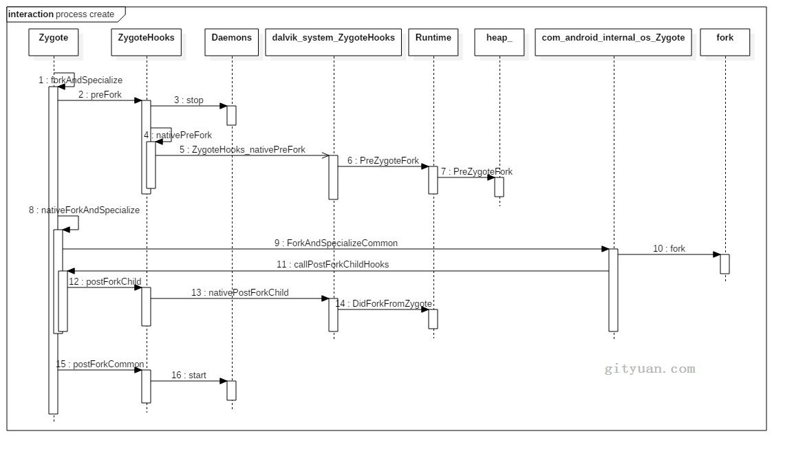

# 1.概述
## 1.1 准备知识

Android中进程和线程的区别：

* **进程**：每个APP启动前创建一个进程，进程由Zygote fork出来，App中很少提进程概念，APP程序运行在Android Runtime上。APP创建进程方法有：AndroidManifest.xml中配置`Android:process`属性，或者native代码系统调用fork.
	* `system_server`进程：管理整个Java framework层，包含各种系统服务。
	* `Zygote`进程：是Android系统的首个Java进程，是所有Java进程的父进程，包括`system_server`进程以及所有的APP进程都是Zygote的子进程。
* **线程**:`new Thread().start()`

## 1.2进程创建过程


* 1.**APP发起进程**：应用跳转，或者lancher，启动APP。先通过binder发送消息给system_server进程。
* 2.**system_server进程**：调用`Process.start()`方法，通过socket向zygote进程发送创建新进程请求。
* 3.**zygote进程**：在执行`ZygoteInit.main()`后便进入`runSelectLoop()`循环体内，当客户端连接时便会执行`ZygoteConnection.runOnce()`方法，再经过调用后`fork`出新应用进程。
* 4.**新进程**:执行`handleChildProc`方法，最后调用`ActivityThread.main()`方法。

# 2.system_server发起请求

```java
//Process.java
public static final ProcessStartResult start
(final String processClass,final String niceName,int uid,
int gid,int[] gids,int debugFlags,int mountExternal,
int targetSdkVersion,String seInfo,String abi,
String instructionSet,String appDataDir,String[] zygoteArgs){
	try{
		return startViaZygote(processClass,niceName,uid,gid,gids
		debugFlags,mountExternal,targetSdkVersion,seInfo,
		abi,instructionSet,appDataDir,zygoteArgs);
	}catch(ZygoteStartFailedEx ex){
		throw new RuntimeException("");
	}
}
private static ProcessStartResult startViaZygote(
final String processClass,final String niceName,final int uid,
final int gid,final int[] gids,int debugFlags,int mountExternal,int targetSdkVersion,String seInfo,
String abi,String instructionSet,String appDataDir,String[] extraArgs) throws ZygoteStartFailedEx
{
	sychronize(Process.class){
		ArrayList<String> argsForZygote=new ArrayList<String>();
		argsForZygote.add("--runtime-args");
		argsFrozygote.add("--setuid="+uid);
		 argsForZygote.add("--setgid=" + gid);
		argsForZygote.add("--target-sdk-version=" + targetSdkVersion);
		if(niceName!=null){
			argsForZygote.add("--nice-name"+niceName);
		}
		//是否意味着，这里可以定制app数据目录？ 和恢复出厂连起来？
		if(appDataDir!=null){
			argsForZygote.add("--app-data-dir="+appDataDir);
		}
		argsForZygote.add(processClass);
		if(extraArgs!=null){
			for(String arg:extraArgs){
				argsForZygote.add(arg);
			}
		}
		return zygoteSendArgsAndGetResult(
			openZygoteSocketIfNeeded(abi),argsForZygote
		);
	}
}
```

前面工作主要完成生成`argsForZygote`数组，保存进程uid,gid,groups等参数。

```java
//Process.java
private static ProcessStartResult zygoteSendArgsAndGetResult(
ZygoteState zygoteState,ArrayList<String> args
)throws ZygoteStartFailedEx{
	try{
		final BufferWriter writer=zygoteState.writer;
		final DataInputStream inputStream=zygoteState.inputStream;
		writer.write(Integer.toString(args.size()));
		writer.newLine();
		int sz=args.size();
		for(int i=0;i<sz;i++){
			String arg=args.get(i);
			if(arg.indexOf('\n')>0){
				throw new ZygoteStartFailedEx("embeded newlines not allowed");
			}
			writer.write(arg);
			writer.newLine();
		}
		writer.flush();

		ProcessStartResult result=new ProcessStartResult();
		//等待socket服务端(zygote)返回新创建的进程pid
		//对于等待时长问题，暂时未加
		result.pid=inputStream.readInt();
		if(result.pid<0){
			throw new ZygoteStartFailedEx("fork() failed");
		}	
		result.usingWrapper=inputStream.readBoolean();
	return result;
	}catch(IOException ex){
		zygoteState.close();
		throw new ZygoteStartFailedEx(ex);
	}
}
```

这个方法的主要功能是通过socket通道向Zygote进程发送一个参数列表，然后进入`阻塞等待状态`，直到远端的socket服务端发送回来新创建的`进程pid`才返回。

```
private static ZygoteState openZygoteSocketIfNeeded(String abi)
throws ZygoteStateFailedEx{
	if(primaryZygoteState==null||primaryZygoteState.isClosed()){
		try{
			//向主zygote发起connect
			primaryZygoteState=ZygoteState.connect(ZYGOTE_SOCKET);
		}catch(IOException ioe){
		}
	}
	if(primaryZygoteState.matches(abi)){
		return primaryZygoteState;
	}
	if(secondayZygoteState==null||secondaryZygoteState.isClosed()){
		//当主zygote没能匹配成功，采用第二个zygote
		secondayZygoteState=ZygoteState.connect(SECONDAY_ZYGOTE_SOCKET);
	}
	if(secondaryZygoteState.matches(abi)){
		return seconaryZygoteState;
	}
}
```
`openZygoteSocketIfNeeded(abi)`方法是根据当前的abi来选择与`zygote`还是`zygote64`来进行通信。

既然system_server进程的`zygoteSendArgsAndGetResult()`方法通过socket向Zygote进程发送消息，这是便会唤醒Zygote进程，`来响应socket客户端`的请求（即system_server端），接下来的操作便是在Zygote来创建进程.


# 3.Zygote创建进程

zygote进程是由init进程而创建的，进程启动之前调用`ZygoteInit.main()`方法，经过`创建socket管道`，`预加载资源`，便进入`runSelcetLoop()`方法。

**TIP**:子线程和子进程判别：线程与进程的最为本质的区别便是是否共享内存空间，图中VSIZE和Zygote进程相同的才是Zygote的子线程，否则就是Zygote的子进程。

图中线程名显示的并不完整是由于底层的进程结构体task_struct是由长度为16的char型数组保存，超过15个字符便会截断。

```
$ ps -t | grep "808432"
USER      PID   PPID  VSIZE  RSS     WCHAN    PC         NAME
root      3434  1     808432 19948 ffffffff 40049890 S zygote
root      15408 3434  808432 19948 ffffffff 4004ab68 S ReferenceQueueD
root      15409 3434  808432 19948 ffffffff 4004ab68 S FinalizerDaemon
root      15411 3434  808432 19948 ffffffff 4004ab68 S FinalizerWatchd
```
Zygote进程有4个Daemon子线程分别是`ReferenceQueueDaemon`，`FinalizerDaemon`，`FinalizerWatchdogDaemon`，`HeapTaskDaemon`。

## 3.1 Zygote启动过程

```java
//ZygoteInit.java
public static void main(String argv[]){
	try{
		runSelectionLoop(abiList);
	}catch(MethodAndArgsCaller caller){
		//runSelectLoop()方法抛出异常MethodAndArgsCaller从而进出入caller.run()方法
		caller.run();
	}catch(RuntimeException ex){
		closeServerSocket();
		throw ex;
	}
}

private static void runSelectLoop(String abiList) throws MethodAndArgsCaller{
	ArrayList<FileDescriptor> fds=new ArrayList<FileDescriptor>();
	ArrayList<ZygoteConnection> peers=new ArrayList<ZygoteConnection>();
	//sServerSocket是socket通信中服务端，zygote进程保存到fds[0]
	fds.add(sServerSocket.getFileDescriptor());
	peers.add(null);
	while(true){
		StructPollfd[] pollFds=new StructPollfd[fds.size()];
		for(int i=0;i<pollFds.length;++i){
			pollFds[i]=new StructPollfd();
			pollFds[i].fd=fds.get(i);
			pollFds[i].events=(short)POLLIN;
		}
		try{
			//处理轮询状态，当epollFds有事件来则往下执行，否则阻塞在这里
			Os.poll(pollFds,-1);
		}catch(ErrorException ex){
		}
		for(int i=pllFds.length-1;i>=0;--i){
			if((pollFds[i].events.&POLLIN)==0){
				continue;
			}
			if(i==0){
				//即fds[0]，代表是sServerSocket，则意味有客户端连接请求
				//则创建ZygoteConnection对象，并添加到fds
				ZygoteConnection new Peer=acceptCommandPeer(abiList);
				peers.add(newPeer);
				fds.add(newPeer.getFileDescriptor());
			}else{
				//i>0，则代表通过socket接收来自对端的数据，并执行相应操作
				boolean done=peers.get(i).runOnce();
				if(done){
					peers.remove(i):
					//处理完成则从fds中移除文件描述符
					fds.remove(i);
				}
			}
		}
	}
}
```

该方法主要功能：

* 客户端通过`openZygoteSocketIfNeeded()`来跟zygote进程建立连接。zygote进程收到客户端连接请求后执行`accept()`；然后再创建`ZygoteConnection`对象,并添加到fds数组列表；
* 建立连接之后，可以跟客户端通信，进入`runOnce()`方法来接收客户端数据，并执行进程创建工作。


## 3.2 zygote新的客户端

```java
//ZygoteInit.java
private static ZygoteConnection acceptCommondPeer(String abiList){
	try{
		return new ZygoteConnetion(sServerSocket.accept(),abiList);
	}catch (IOException ex){
	}
}
```
接收客户端发送过来的`connect()`操作，Zygote作为服务端执行`accept()`操作。 再后面客户端调用`write()`写数据，Zygote进程调用`read()`读数据。

没有连接请求时会进入休眠状态，当有创建新进程的连接请求时，唤醒Zygote进程，创建Socket通道ZygoteConnection，然后执行ZygoteConnection的runOnce()方法。

## 3.3 已连接客服端处理

```java
//ZygoteConnection.java
boolean runOnce() throws ZygoteInit.MethodAndArgsCaller{
	String args[];
	Arguments parsedArgs=null;
	FileDescriptor[] descriptors;
	try{
		//读取socket客户端发送过来的参数列表
		args=readArgumentList();
		descriptors=mSocket.getAncillaryFileDescriptors();
	}catch(IOException ex){
		closeSocket();
		return true;
	}
	PrintStream newStderr=null;
	if(fd !=null){
		fdsToClose[0]=fd.getInt$();
	}
	fd=null;
	pid=Zygote.forkAndSpecialize(
		parsedArgs.uid,parsedArgs.gid,parsedArgs.gids,parsedArgs.debugFlags, rlimits, parsedArgs.mountExternal, parsedArgs.seInfo,parsedArgs.niceName, fdsToClose,parsedArgs.instructionSet,
                parsedArgs.appDataDir);
	);
	try{
		if(pid==0){
			//子继承执行
			IoUtils.closeQuietly(serverPipFd);
			serverPipeFD=null;
			handleChildProc(parsedArgs, descriptors, childPipeFd, newStderr);
			//不应该代到达这里，子进程预期的是抛出异常
			//ZygoteInit.MethodAndArgsCaller或者执行exec();
			return true;
		}else{
			//父进程执行
			IoUtils.closeQuietly(childPipFd);
			childPipeFd=null;	
			return handleParentProc(pid,descriptors,serverPipFd,parsedArgs);
		}
	}finally{
		IoUtils.closeQuitely(childPipeFd);
		IoUtils.closeQuitely(serverPipeFd);
	}
}
```

### 3.3.1 forkAndSpecialize

```java
public static int forkAndSpecialize(
int uid, int gid, int[] gids, int debugFlags, int[][] rlimits, int mountExternal, String seInfo, 
String niceName, int[] fdsToClose, String instructionSet, String appDataDir){
	VM_HOOKS.preFork();
	int pid=nativeForkAndSpecialize(
uid, gid, gids, debugFlags, rlimits, mountExternal, seInfo, niceName, fdsToClose,instructionSet, appDataDir
	);

	...
	VM_HOOKS.postForkCommon();
	return pid;
}

//ZygoteHooks.java
public void preFork(){
	停止4个Damon子线程
	Daemons.stop();
	waitUntilAllThreadsStopped();
	//完成gc堆的初始化工作
	token=nativePreFork();
}

public static void stop(){
	//JAVA 堆整理线程
	HeapTaskDaemon.INSTACNCE.stop();
	//应用队列线程
	ReferenceQueueDaemon.INSTANCE.stop();
	//析构线程
	FinalizerDaemon.INSTANCE.stop();
	//析构监控线程
	FinalizerWatchdogDaemon.INSTACNCE.stop();
}

private static void waitUtilAllThreadStopped(){
	File task=new File("/proc/self/task");
	//当/proc中线程数大于1,就出让CPU直到只有一个线程，才退出循环
	while(tasks.list().lenght>1){
		Thread.yield();
	}
}
```
VM_HOOKS是Zygote对象的静态成员变量：`VM_HOOKS = new ZygoteHooks()`;

**nativePreFork通过JNI最终调用**如下方法：

```
//dalvik_system_ZygoteHooks.cc
static jlong ZygoteHooks_nativePreFork(JNIEnv*env,jclass){
	Runtime* runtime=Runtime::Current();
	runtime->PreZygoteFork();
	if(Trace::GetMethodTracingMode!=TracingMode::kTracingInactive){
		Trace::Pause();
	}
	//将线程转化为long型，并保存到token，该过程是非安全的
	return reinterpret_cast<jlong>(ThreadForEnv(env));
}
```
`VM_HOOKS.preFork()`的主要功能便是停止Zygote的4个Daemon子线程的运行，等待并确保Zygote是`单线程`（用于提升fork效率），并等待这些线程的停止，初始化gc堆的工作, 并将线程转换为long型并保存到token.

`nativeForkAndSpecialize()`通过JNI最终调用调用如下方法：

```cpp
static jint com_android_internal_os_Zygote_nativeForkAndSpecialize(
JNIEnv*env,jclass,jint uid,jint gid,jintArray gids,
jnit debug_flags,jobjectArray rlimits,
jint mount_external,jstring se_info,jstring se_name,
jintArray fdsToClose,jstring instructionSet,jstring appDataDir
){
	//将CAP_WAKE_ALARM赋予蓝牙进程
	jlong capablities=0;
	if(uid==AID_BLUETOOTH){
		capabilities|=(1LL<<CAP_WAKE_ALARM);
	}
	return ForkAndSpecializeCommon(env, uid, gid, gids, debug_flags,
            rlimits, capabilities, capabilities, mount_external, se_info,
            se_name, false, fdsToClose, instructionSet, appDataDir);
}
```

**ForkAndSpecializeCommon**

```c
static pid_t ForkAndSpecializeCommon(JNIEnv* env, uid_t uid, gid_t gid, jintArray javaGids,
 jint debug_flags, jobjectArray javaRlimits, jlong permittedCapabilities, jlong effectiveCapabilities, jint mount_external, 
jstring java_se_info, jstring java_se_name, bool is_system_server, jintArray fdsToClose, 
jstring instructionSet, jstring dataDir){
	//设置子进程的signal信号处理函数
	SetSigChldHandler();
	//fork子进程
	pid_t pid=fork();
	if(pid==0){
		//关闭并清楚文件描述符
		DetachDescriptors(env,fdsToClose);
		if(!is_system_server){
		//对于非system_server子进程，则创建进程组
		int rc=createProcessGroup(uid,getpid());
	}
	SetGids(env,javaGids);
	SetRLimits(env,javaRlimits);
	int rc=setresgid(gid,gid,gid);
	rc=setresuid(uid,uid,uid);
	//selinux上下文
	rc=selinux_android_setcontext(uid,is_system_server,se_info_c_str,se_name_c_str);
	if(se_info_c_str==NULL && is_system_server){
		se_name_c_str="system_server";
	}
	if(se_info_c_str!=NULL){
		//设置线程名为system_server方便调试
		SetThreadName(se_name_c_str);
	}
	//在Zygote进程中，设置信号SIGCHLD的处理器恢复默认行为
	UnsetSigChldHandler();
	//等价于调用zygote.callPostForkChildHook()
	env->CallStaticVoidMethod(gZygoteClass,gCallPostForkChildHook,debug_flags,
		is_system_server?NULL:instructionSet);
	}else if(pid>0){
		//进入父进程,即zygote进程
	}
	return pid;
}
```

## 3.4 zygote小结

`fork()`的主要工作是寻找空闲的`进程号pid`，然后从父进程拷贝进程信息，例如数据段和代码段，fork()后子进程要执行的代码等。 Zygote进程是所有Android进程的母体，包括system_server和各个App进程。zygote利用fork()方法生成新进程，对于新进程A复用Zygote进程本身的资源，再加上新进程A相关的资源，构成新的应用进程A。




到此App进程已完成了创建的所有工作，接下来开始新创建的App进程的工作。在前面`ZygoteConnection.runOnce`方法中，zygote进程执行完`forkAndSpecialize()`后，新创建的App进程便进入`handleChildProc()`方法，下面的操作运行在App进程。

# 4.新进程运行

创建新进程后，返回值pid=0，继续执行`handleChildProc()`.

```java
//ZygoteConneciton.java
private void handleChildProc()Arguments parsedArgs, FileDescriptor[] descriptors, FileDescriptor pipeFd, PrintStream newStderr) 
throws ZygoteInit.MethodAndArgsCaller {
	//关闭zygote的socket两端连接
	closeSocket();
	ZygoteInit.closeServerSocket();
	if(descriptor!=null){
		try{
			Os.dup2(descriptors[0],STDIN_FIFLENO);
			Os.dup2(descriptors[1],STDOUT_FILENO);
			Os.dup2(descriptor[2],STDERR_FILENO);
			for(FileDescriptor fd:descriptor){
				IoUtils.clsoeQuitely(fd);
			}
			newStderr=System.err;
		}catch(ErrnoException ex){
			Log.e(TAG,"Error reopening stdio",ex);
		}
	}
	if(parseArgs.niceName!=null){
		//设置进程名
		Process.setArgV0(parseArgs.niceName);
	}
	if(parseArgs.invokeWidth!=null){
		//这里检测进程内存泄漏或溢出场景设计
		WrapperInit.execApplicaiton(parsedArgs.invokeWith,
                parsedArgs.niceName, parsedArgs.targetSdkVersion,
                VMRuntime.getCurrentInstructionSet(),
                pipeFd, parsedArgs.remainingArgs);
	}else{
		//执行目标类的main()方法
        RuntimeInit.zygoteInit(parsedArgs.targetSdkVersion,
                parsedArgs.remainingArgs, null);
	}
}

//RuntimeInit.java
public static final void zygoteInit(int targetSdkVersion, String[] argv, ClassLoader classLoader)
 throws ZygoteInit.MethodAndArgsCaller{
	//重定向log输出
	redirectionLogStream();
	//通用的一些初始化
	commonInit();
	//zygote初始化.启动binder线程池
	nativeZygoteInit();
	//应用初始化
	applicationInit(targetSdkVersion, argv, classLoader);
}
```

## 4.1 commonInit

```java
//RuntimeInit.java
private static final void commonInit(){
	// 设置默认的未捕捉异常处理方法
 	Thread.setDefaultUncaughtExceptionHandler(new UncaughtHandler());
	//设置市区
	TimezoneGetter.setInstance(new TimezoneGetter(){
		public String getId(){
			return SystemProperties.get("persist.sys.timezone");
		}
	});
	Timezone.setDefault(null);
	//重置log配置
	LogManager.getLoManager().reset();
	new AndroidConfig();
	
	//设置默认的HTTP User-agent格式，用于HttpURLConneciton
	String userAgent=getDefaultUserAgent();
	System.setProperty("http.agent",userAgent);
	//设置socket的tag，用于网络流量统计
	NetworkManagementSocketTagger.install();
}
```

默认的HTTP User-agent格式，例如：

```
"Dalvik/1.1.0 (Linux; U; Android 6.0.1；LenovoX3c70 Build/LMY47V)".
```

## 4.2 applicationInit

```java
private static void applicaitonInit(int targetSdkVersion, String[] argv, ClassLoader classLoader)
 throws ZygoteInit.MethodAndArgsCaller{
	//true代表应用程序退出时不调用AppRuntime.onExit(),否则会在退出前调用
	nativeSetExitWithoutCleanup(true);
	//设置虚拟机内存利用率参数值为0.75s
	VMRuntime.getRuntime().setTargetHeapUtilization(0.8=75f);
	VMRuntime.getRuntime().setTargetSdkVersion(targetSdkVersion);
	final Argument args;
	try{
		args=new Argumnet(argv);//解析参数
	}catch(IllegalArgumentException ex){
		return;
	}
	Trace.traceEnd(Trace.TRACE_TAG_ACTIVITY_MANAGER);
	//调用startClass的static方法main()
	invokeStaticMain(args.startClass,args.startArgs,classLoader);
}
```
此处args.startClass为”android.app.ActivityThread”。

```java
//RuntimeInit.java
private static void invokeStaticMain(String className, String[] argv, ClassLoader classLoader) throws ZygoteInit.MethodAndArgsCaller{
	Class<?> cl=Class.forName(className,true,classLoader);
	Method m=cl.getMethod("main",new Class[]{String[].class});
	int modifiers=m.getModifiers();
	...
	//通过抛出异常，回到ZygoteInit.main()，这样好处，能清空栈，体站栈帧利用率
	throw new ZygoteInit.MethodAndArgsCaller(m,argv);
}
```
`invokeStaticMain()`方法中抛出的异常MethodAndArgsCaller caller，该方法的参数m是指main()方法, argv是指`ActivityThread`. 根据前面的中可知，下一步进入`caller.run()`方法，也就是`MethodAndArgsCaller.run()`。

## 4.3MethodAndArgsCaller

```java
//ZygoteInit.java
public static class MethodAndArgsCaller extends Exception implements Runnable{
	public void run(){
		try{
			//根据传递过来的参数，此处反射调用ActivityThread.main()方法
			mMethod.invoke(null,new Object[]{margs});
		}catch ...
	}
}
```

到此，总算是进入到了ActivityThread类的`main()`方法。

## 4.4 ActivityThread.main

```java
//ActivityThread.java
public static void main(String[] args){
	...
	Environment.initForCurrentUser();
	...
	Process.setArgV0("<pre-initialized>");
	//创建主线程looper
	Looper.prepareMainLooper();
	ActivityThread thread=new ActivityThread();
	//attach到系统进程
	thread.attach(false);
	if(sMainThreadHandler==null){
		sMainThreadHandler=thread.getHandler();
	}
	//主线程进入循环状态
	Looper.loop();
	throw new RuntimeException("Main thread loop unexceptedly exited");
}
```

## 5.总结


上图中，`system_server`进程通过socket IPC通道向zygote进程通信，zygote在fork出新进程后由于fork调用一次，返回两次，即在zygote进程中调用一次，在zygote进程和子进程中各返回一次，从而能进入子进程来执行代码。该调用流程图的过程：

* system_server进程：1~3,通过Process.start()方法发起创建新进程请求，会先收集各种新进程uid、gid、nice-name等相关的参数，然后通过socket通道发送给zygote进程；
* zygote进程,4~12.接收到system_server进程发送过来的参数后封装成Arguments对象，图中绿色框forkAndSpecialize()方法是进程创建过程中最为核心的一个环节（详见流程6），其具体工作是依次执行下面的3个方法：
	* preFork()：先停止Zygote的4个Daemon子线程（java堆内存整理线程、对线下引用队列线程、析构线程以及监控线程）的运行以及初始化gc堆；
	* nativeForkAndSpecialize()：调用linux的fork()出新进程，创建Java堆处理的线程池，重置gc性能数据，设置进程的信号处理函数，启动JDWP线程；
	* postForkCommon()：在启动之前被暂停的4个Daemon子线程。

* 新进程：13~15进入`handleChildProc()`方法，设置进程名，打开binder驱动，启动新的binder线程；然后设置art虚拟机参数，再反射调用目标类的main()方法，即`Activity.main()`方法。


再之后的流程，如果是`startActivity`则将要进入Activity的`onCreate/onStart/onResume`等生命周期；如果是`startServic`e则将要进入Service的`onCreate`等生命周期。

system_server进程等待zygote返回进程创建完成(ZygoteConnection.handleParentProc), 一旦`Zygote.forkAndSpecialize()`方法执行完成, 那么分道扬镳, `zygote`告知`system_server`进程进程已创建, 而子进程继续执行后续的`handleChildProc`操作.

**Tips2**: `RuntimeInit.java`的方法`nativeZygoteInit()`会调用到`onZygoteInit()`，这个过程中有`startThreadPool()`创建Binder线程池。也就是说每个进程无论是否包含任何activity等组件，一定至少会包含一个Binder线程。

参考：

