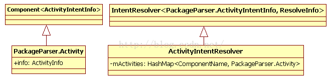

PKMS除了负责Android系统中Package的`安装`、`升级`、`卸载`外，还有一项很重要的职责，就是对外提供统一的`信息查询功能`，其中包括查询系统中匹配某Intent的`Activities`、`BroadCastReceivers`或`Services`等。本节将以查询匹配某Intent的Activities为例，介绍PKMS在这方便提供的服务。

<!--more-->

# 1.基本介绍
## 1.1Intent介绍
Android系统明确指定的一个Intent可由两方面属性来衡量。

* `主要属性`：包括Action和Data。其中Action用于表示该Intent所表达的动作意图、Data用于表示该Action所操作的数据。

* `次要属性`：包括`Category`、`Type`、`Component`和`Extras`。其中Category表示类别，Type表示数据的MIME类型，Component可用于指定特定的Intent响应者（例如指定广播接收者为某Package的某个BroadcastReceiver），Extras用于承载其他的信息。

## 1.2IntentFilter介绍
Andorid规定了3项内容.

* `Action`：求职方支持的Intent动作（和Intent中的Action对应）。
* `Category`：求职方支持的Intent种类（和Intent的Category对应）。
* `Data`：求职方支持的Intent 数据（和Intent的Data对应，包括URI和MIME类型）。

# 2. Activity信息的管理

前面在介绍PKMS扫描APK时提到，PKMS将解析得到的Package私有的Activity信息加入到自己的数据结构mActivities中保存。先来回顾一下代码：

```java
//[-->PacakgeManagerService.java::scanPackageLI函数]
......//此时APK文件已经解析完成
N =pkg.activities.size();//取出该APK中包含的Activities信息
r =null;
for (i=0; i<N; i++) {
   PackageParser.Activity a =pkg.activities.get(i);
   a.info.processName = fixProcessName(pkg.applicationInfo.processName,                                 a.info.processName,pkg.applicationInfo.uid);
   mActivities.addActivity(a,"activity");//①加到mActivities中保存
 }
```
上面的代码中有两个比较重要的数据结构



* `mActivities`为ActivityIntentResolver类型，是PKMS的成员变量，用于保存系统中所有与Activity相关的信息。此数据结构内部有一个`mActivities`变量，它以ComponetName为Key，保存`PackageParser.Activity`对象
* 从APK中解析得到的所有和Activity相关的信息（包括在XML中声明的IntentFilter标签）都由PacakgeParser.Activity来保存。

前面代码中调用addActivity函数完成了私有信息的公有化。addActivity函数的代码如下：

```java
public final voidaddActivity(PackageParser.Activity a, String type) {
     finalboolean systemApp = isSystemApp(a.info.applicationInfo);
     //将Component和Activity保存到mActivities中
     mActivities.put(a.getComponentName(), a);
     finalint NI = a.intents.size();
     for(int j=0; j<NI; j++) {
     	//ActivityIntentInfo存储的就是XML中声明的IntentFilter信息
    	PackageParser.ActivityIntentInfo intent = a.intents.get(j);
     	if(!systemApp && intent.getPriority() > 0 &&"activity".equals(type)) {
          //非系统APK的priority必须为0。后续分析中将介绍priority的作用
          intent.setPriority(0);
        }
         addFilter(intent);//接下来将分析这个函数
      }
 }
```

下面来分析addFilter函数，这里涉及较多的复杂数据结构;

```java
public void addFilter(F f) {
   ......
   mFilters.add(f);//mFilters保存所有IntentFilter信息
   //除此之外，为了加快匹配工作的速度，还需要分类保存IntentFilter信息
   //下边register_xxx函数的最后一个参数用于打印信息
   intnumS = register_intent_filter(f, f.schemesIterator(),                      mSchemeToFilter,"      Scheme: ");
   intnumT = register_mime_types(f, "     Type: ");
   if(numS == 0 && numT == 0) {
		register_intent_filter(f, f.actionsIterator(),              mActionToFilter," Action: ");
        }
        if(numT != 0) {
           register_intent_filter(f, f.actionsIterator(,            mTypedActionToFilter, "     TypedAction: ");
        }
 }
```
正如代码注释中所说，为了加快匹配工作的速度，这里使用了泛型编程并定义了较多的成员变量。下面总结一下这些变量的作用（注意，除mFilters为`HashSet<F>`类型外，其他成员变量的类型都是`HashMap<String, ArrayList<F>`，其中F为模板参数）。

* `mSchemeToFilter`：用于保存`URI`中与`schema`相关的`IntentFilter`信息。
* `mActionToFilter`：用于保存仅设置Action条件的IntentFilter信息。
* `mTypedActionToFilter`：用于保存既设置了Action又设置了Data的MIME类型的IntentFilter信息。
* `mFilters`：用于保存所有IntentFilter信息
* `mWildTypeToFilter`：用于保存设置了Data类型类似`image/*`的IntentFilter，但是设置MIME类型类似`Image/jpeg`的不算在此类。
* `mTypeToFilter`：除了包含mWildTypeToFilter外，还包含那些指明了Data类型为确定参数的IntentFilter信息，例如`image/*`和`image/jpeg`等都包含在mTypeToFilter中。
* `mBaseTypeToFilter`：包含MIME中Base 类型的IntentFilter信息，但不包括Sub type为`*`的IntentFilter。

不妨举个例子来说明这些变量的用法。假设，在XML中声明一个IntentFilter，代码如下：

```xml
<intent-filter android:label="test">
<action android:name="android.intent.action.VIEW" />
   data android:mimeType="audio/*" android:scheme="http"
 </intent-filter>
```
那么：

* 在mTypedActionToFilter中能够以“android.intent.action.VIEW”为key找到该IntentFilter。
* 在mWildTypeToFilter和mTypeToFilter中能够以“audio”为key找到该IntentFilter。
* 在mSchemeToFilter中能够以”http“为key找到该IntentFilter。

# 3.Intent 匹配查询分析

## 3.1客户端查询
客户端通过ApplicationPackageManager输出的`queryIntentActivities`函数向PKMS发起一次查询请求，代码如下：

```java
public List<ResolveInfo>queryIntentActivities(Intent intent, int flags) {
   try {
        return mPM.queryIntentActivities(
               intent,//下面这句话很重    
			  intent.resolveTypeIfNeeded(mContext.getContentResolver()), flags);
        }......

}
```
如果Intent的Data包含一个URI，那么就需要查询该URI的提供者（即ContentProvider）以取得该数据的数据类型.另外，flags参数目前有3个可选值，分别是`MATCH_DEFAULT_ONLY`、`GET_INTENT_FILTERS`和`GET_RESOLVED_FILTER`。

## 3.2queryIntentActivities分析

该函数代码如下：

```java
//[-->PacakgeManagerService.java::queryIntentActivities]
public List<ResolveInfo>queryIntentActivities(Intent intent,
                                 String resolvedType, int flags) {
    final ComponentName comp = intent.getComponent();
    if(comp != null) {
       //Explicit的Intents，直接根据component得到对应的ActivityInfo
       final List<ResolveInfo> list = new ArrayList<ResolveInfo>(1);
       final ActivityInfo ai = getActivityInfo(comp, flags);
       if (ai != null) {
            final ResolveInfo ri = new ResolveInfo();
            //ResovlerInfo的activityInfo指向查询得到的ActivityInfo
            ri.activityInfo = ai;
            list.add(ri);
       }
           return list;
    }
    synchronized (mPackages) {
       final String pkgName = intent.getPackage();
       if (pkgName == null) {
              //Implicit Intents，我们重点分析此中情况
              return mActivities.queryIntent(intent, resolvedType, flags);
       }
       //Intent指明了PackageName，比Explicit Intents情况差一点
       final PackageParser.Package pkg = mPackages.get(pkgName);
       if (pkg != null) {
       //其实是从该Package包含的Activities中进行匹配查询
       return mActivities.queryIntentForPackage(intent, resolvedType,
                                           flags, pkg.activities);
       }
       return new ArrayList<ResolveInfo>();
   }
}
```
上边代码分三种情况：

* 如果Intent指明了Component，则直接查询该Component对应的ActivityInfo。
* 如果Intent指明了Package名，则根据Package名找到该Package，然后再从该Package包含的Activities中进行匹配查询。
* 如果上面条件都不满足，则需要在全系统范围内进行匹配查询，这就是queryIntent的工作。

queryIntent函数的代码如下：

```java
public List<ResolveInfo> queryIntent(Intentintent, String resolvedType,intflags) {
    mFlags =flags;
   //调用基类的queryIntent函数
   return super.queryIntent(intent, resolvedType,
               (flags&PackageManager.MATCH_DEFAULT_ONLY) != 0);
}
//[-->IntentResolver.java::queryIntent]
public List<R> queryIntent(Intent intent,String resolvedType,booleandefaultOnly) {
  Stringscheme = intent.getScheme();
  ArrayList<R> finalList = new ArrayList<R>();
  //最多有四轮匹配工作要做
  ArrayList<F> firstTypeCut = null;
  ArrayList<F> secondTypeCut = null;
  ArrayList<F> thirdTypeCut = null;
  ArrayList<F> schemeCut = null;
  //下面将设置各轮校验者
  if(resolvedType != null) {
     intslashpos = resolvedType.indexOf('/');
     if(slashpos > 0) {
         final String baseType = resolvedType.substring(0, slashpos);
         if (!baseType.equals("*")) {
             if (resolvedType.length() != slashpos+2
                   || resolvedType.charAt(slashpos+1) != '*') {
                       firstTypeCut =mTypeToFilter.get(resolvedType);
                       secondTypeCut =mWildTypeToFilter.get(baseType);
                   }......//略去一部分内容
           }
        }
      if(scheme != null) {
           schemeCut = mSchemeToFilter.get(scheme);
      }
      if(resolvedType == null && scheme == null && intent.getAction()!= null)
      {
       //看来action的filter优先级最低
       firstTypeCut = mActionToFilter.get(intent.getAction());
      }
    //FastImmutableArraySet是一种特殊的数据结构，用于保存该Intent中携带的
    //Category相关的信息。
    FastImmutableArraySet<String>categories = getFastIntentCategories(intent);
    if(firstTypeCut != null) {
    //匹配查询，第一轮过关斩将
    buildResolveList(intent, categories, debug, defaultOnly,resolvedType, scheme, firstTypeCut,finalList);
    }
    if(secondTypeCut != null) {
        buildResolveList(intent, categories, debug, defaultOnly,resolvedType, scheme, secondTypeCut, finalList);
    }
    if(thirdTypeCut != null) {
        buildResolveList(intent, categories, debug, defaultOnly,resolvedType, scheme, thirdTypeCut, finalList);
     }
    if(schemeCut != null) {
        //生成符合schemeCut条件的finalList
        buildResolveList(intent, categories, debug, defaultOnly, resolvedType, scheme, schemeCut, finalList);
    }
   //将匹配结果按Priority的大小排序
   sortResults(finalList);
   return finalList;
}
```
在以上代码中设置了最多四轮匹配关卡，然后逐一执行匹配工作。具体的匹配代码由buildResolveList完成，无非是一项查找工作而已。此处就不再深究细节了，不宜深究其中的数据结构。

# 4.queryIntentActivities总结
本节分析了queryIntentActivities函数的实现，其功能很简单，就是进行Intent匹配查询。一路走来主要原因是涉及的数据结构较多，让人有些头晕。不要在数据结构上花太多时间，最好结合SDK中的文档说明来分析相关代码。


