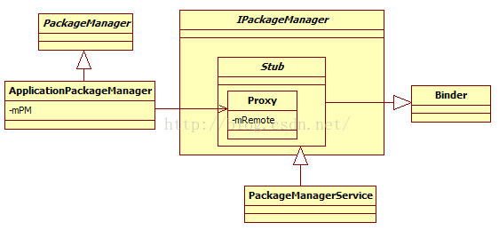
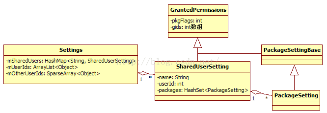
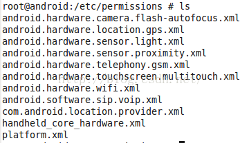
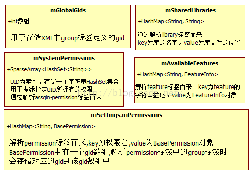

# 0.概述
PackageManagerService是本书分析的第一个核心服务，也是Android系统中最常用的服务之一。它负责系统中`Package的管理`，`应用程序的安装`、`卸载`、`信息查询`等.

<!--more-->



*  IPackageManager接口类中定义了服务端和客户端通信的业务函数，还定义了内部类Stub，该类从Binder派生并实现了IPackageManager接口。
*  PackageManagerService继承自IPackageManager.Stub类，由于Stub类从Binder派生，因此PackageManagerService将作为服务端参与Binder通信。
*    Stub类中定义了一个内部类Proxy，该类有一个IBinder类型（实际类型为BinderProxy）的成员变量mRemote，mRemote用于和服务端PackageManagerService通信。
*  IPackageManager接口类中定义了许多业务函数，但是出于安全等方面的考虑，Android对外（即SDK）提供的只是一个子集，该子集被封装在抽象类PackageManager中。客户端一般通过Context的getPackageManager函数返回一个类型为PackageManager的对象，该对象的实际类型是PackageManager的子类ApplicationPackageManager。这种基于接口编程的方式，虽然极大降低了模块之间的耦合性，却给代码分析带来了不小的麻烦。
*  ApplicationPackageManager类继承自PackageManager类。它并没有直接参与Binder通信，而是通过mPM成员变量指向一个IPackageManager.Stub.Proxy类型的对象。

**提示**在源码中可能找不到`IPackageManager.java`文件。该文件在编译过程中是经aidl工具处理IPackageManager.aidl后得到，最终的文件位置在Android源码`/out/target/common/obj/JAVA_LIBRARIES/framework_intermediates/src/core/java/android/content/pm/`.

# 1.PMS初始

PKMS作为系统的核心服务，由SystemServer创建，相关代码如下：

```java
//SystemServer.java......ServerThread的run函数

 /*4.0新增的一个功能，即设备加密（encrypting the device）,该功能由
 系统属性vold.decrypt指定。这部分功能比较复杂，本书暂不讨论。该功能对PKMS的影响就是通过onlyCore实现的，该变量用于判断是否只扫描系统库（包括APK和Jar包*/
 StringcryptState =SystemProperties.get("vold.decrypt");
 booleanonlyCore = false;
 //ENCRYPTING_STATE的值为"trigger_restart_min_framework"
 if(ENCRYPTING_STATE.equals(cryptState)) {......
	onlyCore = true;
 } else if(ENCRYPTED_STATE.equals(cryptState)) {
       ......//ENCRYPTED_STATE的值为"1"
     onlyCore = true;
 }

 //1.调用PKMS的main函数，第二个参数用于判断是否为工厂测试，我们不讨论的这种情况，
 //假定onlyCore的值为false
 pm =PackageManagerService.main(context,factoryTest !=SystemServer.FACTORY_TEST_OFF,onlyCore);
 booleanfirstBoot = false;
 try {
         //判断本次是否为初次启动。当Zygote或SystemServer退出时，init会再次启动
        //它们，所以这里的FirstBoot是指开机后的第一次启动
        firstBoot = pm.isFirstBoot();
 }
......
  try {

        //2.做dex优化。dex是Android上针对Java字节码的一种优化技术，可提高运行效率
       pm.performBootDexOpt();
  }
 ......
  try {
        pm.systemReady();//③通知系统进入就绪状态
 }
 ......
}//run函数结束
```

首先分析PKMS的main函数，它是核心函数.

# 2.PKMS的main

PKMS的main函数代码如下：

```java
public static final IPackageManager main(Contextcontext, boolean factoryTest,boolean onlyCore) {
    //调用PKMS的构造函factoryTest和onlyCore的值均为false
	PackageManagerService m = new PackageManagerService(context,factoryTest, onlyCore);
    //向ServiceManager注册PKMS
    ServiceManager.addService("package", m);
    return m;
 }
```
main函数很简单，只有短短几行代码，执行时间却较长，主要原因是PKMS在其构造函数中做了很多“重体力活”，这也是Android启动速度慢的主要原因之一。

**PKMS构造函数的主要功能是**扫描Android系统中几个目标文件夹中的APK，从而建立合适的数据结构以管理诸如Package信息、四大组件信息、权限信息等各种信息。抽象地看，PKMS像一个加工厂，它解析实际的物理文件（APK文件）以生成符合自己要求的产品。例如，PKMS将解析APK包中的AndroidManifest.xml，并根据其中声明的Activity标签来创建与此对应的对象并加以保管。

PKMS的工作流程相对简单，复杂的是其中用于保存各种信息的数据结构和它们之间的关系，以及影响最终结果的策略控制（例如前面代码中的onlyCore变量，用于判断是否只扫描系统目录）。曾经阅读过PKMS的读者可能会发现，代码中大量不同的数据结构以及它们之间的关系会令人大为头疼。所以，本章除了分析PKMS的工作流程外，也将关注重要的数据结构及它们的作用。

PKMS构造函数的工作流程大体可分三个阶段：

* 1.扫描目标文件夹之前的准备工作。
* 2.扫描目标文件夹。
* 3.扫描之后的工作。

# 3.扫描准备工作

下面开始分析构造函数第一阶段的工作，先看如下所示的代码

```java
//构造函数
public PackageManagerService(Context context,boolean factoryTest,booleanonlyCore) {
	//系统属性“ro.build.version.sdk”
	if(mSdkVersion <= 0) {
		Slog.w(TAG, "**** ro.build.version.sdk not set!");//打印一句警告
	}
	mContext = context;
    mFactoryTest= factoryTest;//假定为false，即运行在非工厂模式下

    mOnlyCore = onlyCore;//假定为false，即运行在普通模式下
	//如果此系统是eng版，则扫描Package后，不对package做dex优化
	mNoDexOpt ="eng".equals(SystemProperties.get("ro.build.type"));
	//如果此系统是eng版，则扫描Package后，不对package做dex优化
	mNoDexOpt ="eng".equals(SystemProperties.get("ro.build.type"));
	 //mMetrics用于存储与显示屏相关的一些属性，例如屏幕的宽/高尺寸，分辨率等信息
	mMetrics = new DisplayMetrics();
	//Settings是一个非常重要的类，该类用于存储系统运行过程中的一些设置，
	mSettings = new Settings();
	
	 //1.addSharedUserLPw是什么？马上来分析
	mSettings.addSharedUserLPw("android.uid.system",Process.SYSTEM_UID,ApplicationInfo.FLAG_SYSTEM);
	mSettings.addSharedUserLPw("android.uid.phone", MULTIPLE_APPLICATION_UIDS  //该变量的默认值是true
				? RADIO_UID :FIRST_APPLICATION_UID,ApplicationInfo.FLAG_SYSTEM);
	 mSettings.addSharedUserLPw("android.uid.log",MULTIPLE_APPLICATION_UIDS? LOG_UID :FIRST_APPLICATION_UID,ApplicationInfo.FLAG_SYSTEM);
	mSettings.addSharedUserLPw("android.uid.nfc",MULTIPLE_APPLICATION_UIDS? NFC_UID :FIRST_APPLICATION_UID,ApplicationInfo.FLAG_SYSTEM);......//第一段结束
}                            
```
就会遇到第一个较为复杂的数据结构Setting及它的addSharedUserLPw函数。Setting的作用是管理Android系统运行过程中的一些设置信息。

## 3.1  初识Settings 
先分析addSharedUserLPw函数。addSharedUserLPw传递了3个参数：
* 第一个是字符串“android.uid.system“；
* 第二个是SYSTEM_UID，其值为1000；
* 第三个是FLAG_SYSTEM标志，用于标识系统Package。

```java
SharedUserSetting addSharedUserLPw(String name,int uid, int pkgFlags) {
      /*注意这里的参数：name为字符串”android.uid.system”,uid为1000，pkgFlags为
		ApplicationInfo.FLAG_SYSETM(以后简写为FLAG_SYSTEM)*/
		//mSharedUsers是一个HashMap，key为字符串，值为SharedUserSetting对象
       SharedUserSetting s = mSharedUsers.get(name);
       if(s != null) {
           if (s.userId == uid) {
               return s;
           }......
           return null;
        }
        //创建一个新的SharedUserSettings对象，并设置的userId为uid，
       //SharedUserSettings是什么？有什么作用？
        s =new SharedUserSetting(name, pkgFlags);
       s.userId = uid;
        if(addUserIdLPw(uid, s, name)) {
           mSharedUsers.put(name, s);//将name与s键值对添加到mSharedUsers中保存
           return s;
        }
       return null;
    }
```
在AndroidManifest.xml中，声明了一个名为android:sharedUserId的属性，其为“android.uid.system”，有两个作用：

* 两个或多个声明了同一种sharedUserIds的APK可共享彼此的数据，并且可运行在同一进程中。
* 更重要的是，通过声明特定的sharedUserId，该APK所在进程将被赋予指定的UID。例如，本例中的SystemUI声明了system的uid，运行SystemUI的进程就可享有system用户所对应的权限（实际上就是将该进程的uid设置为system的uid）了。

**注意**除了在AndroidManifest.xml中声明sharedUserId外，APK在编译时还必须使用对应的证书进行签名。例如本例的SystemUI，在其Android.mk中需要额外声明`LOCAL_CERTIFICATE := platform`，如此，才可获得指定的UID。

Android是设计相应数据结构如下：


 Settings中还有两个成员，一个是`mUserIds`，另一个是`mOtherUserIds`，这两位成员的类型分别是ArrayList和SparseArray。其目的是以UID为索引，得到对应的SharedUserSettings对象。在一般情况下，以索引获取数组元素的速度，比以key获取HashMap中元素的速度要快很多。
**提示** 根据以上对mUserIds和mOtherUserIds的描述，可知这是典型的以空间换时间的做法。
addUserIdLPw函数功能就是将SharedUserSettings对象保存到对应的数组中.

## 3.2 扫描XML文件

下面继续分析PKMS的构造函数:进行**XML文件扫描**

```java
......//接前一段
String separateProcesses = //该值和调试有关。一般不设置该属性
SystemProperties.get("debug.separate_processes")
if(separateProcesses != null && separateProcesses.length() > 0) {
          ......
}else {
	mDefParseFlags = 0;
	mSeparateProcesses = null;
}
//创建一个Installer对象，该对象和Native进程installd交互，以后分析installd时再来讨论它的作用
mInstaller = new Installer();
WindowManager wm =(WindowManager)context.getSystemService(Context.WINDOW_SERVICE);
Display d = wm.getDefaultDisplay();
d.getMetrics(mMetrics); //获取当前设备的显示屏信息
synchronized (mInstallLock) {
	synchronized (mPackages) {
	//创建一个ThreadHandler对象，实际就是创建一个带消息循环处理的线程，该线程
	//的工作是：程序的和卸载等。以后分析程序安装时会和它亲密接触
	mHandlerThread.start();
	//以ThreadHandler线程的消息循环(Looper对象)为参数创建一个PackageHandler，
	//可知该Handler的handleMessage函数将运行在此线程上
	mHandler = new PackageHandler(mHandlerThread.getLooper());
    File dataDir = Environment.getDataDirectory();
	// mAppDataDir指向/data/data目录
	mAppDataDir = new File(dataDir, "data");
	// mUserAppDataDir指向/data/user目录
	mUserAppDataDir = new File(dataDir, "user");
	// mDrmAppPrivateInstallDir指向/data/app-private目录
	mDrmAppPrivateInstallDir = new File(dataDir, "app-private");

    /*
    创建一个UserManager对象，目前没有什么作用，但其前途将不可限量。
     根据Google的设想，未来手机将支持多个User，每个User将安装自己的应用，
     该功能为Andorid智能手机推向企业用户打下坚实基础
     */
	mUserManager = new UserManager(mInstaller, mUserAppDataDir);

     //1.从文件中读权限
     readPermissions();
	//2.readLPw分析
	mRestoredSettings = mSettings.readLPw();
	long startTime = SystemClock.uptimeMillis();
```

## 3.3readPermissions
分析readPermissions函数，从其函数名可猜测到它和权限有关.

```java
void readPermissions() {
   // 指向/system/etc/permission目录，该目录中存储了和设备相关的一些权限信息
   FilelibraryDir = new File(Environment.getRootDirectory(),"etc/permissions");
   ......
	for(File f : libraryDir.listFiles()) {
        //先处理该目录下的非platform.xml文
        if (f.getPath().endsWith("etc/permissions/platform.xml")) {
              continue;
        }
        ......//调用readPermissionFromXml解析此XML文件
        readPermissionsFromXml(f);
    }

    finalFile permFile = new File(Environment.getRootDirectory(),"etc/permissions/platform.xml");
	//解析platform.xml文件，看来该文件优先级最高
	readPermissionsFromXml(permFile);
}
```
`readPermissionFromXml`函数解析`/system/etc/permissions`目录下的文件.



例如：`platform.xml`文件内容如下。

```
<permissions>
   <!--建立权限名与gid的映射关系。如下面声明的BLUTOOTH_ADMIN权限，它对应的用户组是
    net_bt_admin。注意，该文件中的permission标签只对那些需要通过读写设备（蓝牙/camera）
     /创建socket等进程划分了gid。因为这些权限涉及和Linux内核交互，所以需要在底层
     权限（由不同的用户组界定）和Android层权限（由不同的字符串界定）之间建立映射关系
  -->
 	<permission name="android.permission.BLUETOOTH_ADMIN" >
       <group gid="net_bt_admin" />
 	</permission>
 	<permission name="android.permission.BLUETOOTH" >
       <group gid="net_bt" />
  	</permission>
  		......
   <!--
     赋予对应uid相应的权限。如果下面一行表示uid为shell，那么就赋予
       它SEND_SMS的权限，其实就是把它加到对应的用户组中-->
   <assign-permission name="android.permission.SEND_SMS		 "uid="shell" />
   <assign-permission name="android.permission.CALL_PHONE	 "uid="shell" />
   <assign-permission name="android.permission.READ_CONTACTS" uid="shell" />
   <assign-permission name="android.permission.WRITE_CONTACTS"uid="shell" />
   <assign-permissionname="android.permission.READ_CALENDAR" uid="shell" />
......
    <!-- 系统提供的Java库，应用程序运行时候必须要链接这些库，该工作由系统自动完成 -->
    <libraryname="android.test.runner" file="/system/frameworks/android.test.runner.jar" />
    <library name="javax.obex" file="/system/frameworks/javax.obex.jar"/>
</permissions>
```
platform.xml文件中主要使用了如下4个标签：

* `permission`和`group`用于建立Linux层gid和Android层pemission之间的映射关系。
* `assign-permission`用于向指定的uid赋予相应的权限。这个权限由Android定义，用字符串表示。
* `library`用于指定系统库。当应用程序运行时，系统会自动为这些进程加载这些库。

再看其他的XML文件，这里以`handheld-core-hardware.xml`:

```
<permissions>
   <feature name="android.hardware.camera" />
   <feature name="android.hardware.location" />
   <feature name="android.hardware.location.network" />
   <feature name="android.hardware.sensor.compass" />
   <feature name="android.hardware.sensor.accelerometer" />
   <feature name="android.hardware.bluetooth" />
   <feature name="android.hardware.touchscreen" />
   <feature name="android.hardware.microphone" />
   <feature name="android.hardware.screen.portrait" />
   <feature name="android.hardware.screen.landscape" />
</permissions>
```
这个XML文件包含了许多feature标签。根据该文件中的注释，这些feature用来描述一个手持终端（包括手机、平板电脑等）应该支持的硬件特性，例如支持camera、支持蓝牙等。

**注意**对于不同的硬件特性，还需要包含其他的xml文件。例如，要支持前置摄像头，还需要包含`android.hardware.camera.front.xml`文件。这些文件内容大体一样，都通过feature标签表明自己的硬件特性。

设备上`/system/etc/permission`目录中的文件来自：在编译阶段由不同硬件平台根据自己的配置信息复制相关文件到目标目录中得来的。
readPermissionFromXml函数:就是将XML文件中的标签以及它们之间的关系转换成代码中的相应数据结构.

## 3.4readLPw

readLPw函数的功能也是解析文件，不过这些文件的内容却是在PKMS正常启动后生成的。这里仅介绍作为readLPw“佐料”的文件的信息。文件的具体位置在Settings构造函数中指明，其代码如下：

```java
Settings(){
    FiledataDir = Environment.getDataDirectory();
    FilesystemDir = new File(dataDir, "system");//指向/data/system目录
    systemDir.mkdirs();//创建该目录
        ......
    /*一共有5个文件，packages.xml和packages-backup.xml为一组，用于描述系统中
     所安装的Package的信息，其中backup是临时文件。PKMS先把数据写到backup中，
     信息都写成功后再改名成非backup的文件。其目的是防止在写文件过程中出错，导致信息丢失。
	packages-stopped.xml和packages-stopped-backup.xml为一组，用于描述系统中
    强制停止运行的pakcage的信息，backup也是临时文件。如果此处存在该临时文件，表明
   此前系统因为某种原因中断了正常流程packages.list列出当前系统中应用级（即UID大于10000）Package的信息*/
   mSettingsFilename = new File(systemDir, "packages.xml");
   mBackupSettingsFilename = new File(systemDir,"packages-backup.xml");
   mPackageListFilename = new File(systemDir, "packages.list");
   mStoppedPackagesFilename = new File(systemDir,"packages-stopped.xml");
   mBackupStoppedPackagesFilename = new File(systemDir,"packages-stopped-backup.xml");
}
```
上面5个文件共分为三组，这里简单介绍一下这些文件的来历（不考虑临时的backup文件）。

* `packages.xml`： PKMS`扫描完目标文件夹`后会创建该文件。当系统进行`程序安装`、`卸载`和`更新`等操作时，均会**更新该文件**。该文件保存了系统中与`package相关`的一些信息。
* `packages.list`：描述系统中存在的所有`非系统自带的APK`的信息。当这些程序有变动时，PKMS就会更新该文件。
* `packages-stopped.xml`：从系统自带的设置程序中进入应用程序页面，然后在选择强制停止（ForceStop）某个应用时，系统会将该应用的相关信息记录到此文件中。也就是该文件保存系统中被用户强制停止的Package的信息。
readLPw的函数功能就是解析其中的XML文件的内容，然后建立并更新对应的数据结构，例如停止的package重启之后依然是stopped状态。

### 第一阶段工作总结

在继续征程前，先总结一下PKMS构造函数在第一阶段的工作，千言万语汇成一句话：扫描并解析XML文件，将其中的信息保存到特定的数据结构中。

第一阶段扫描的XML文件与权限及上一次扫描得到的Package信息有关，它为PKMS下一阶段的工作提供了重要的参考信息。
# 4.扫描Package
PKMS构造函数第二阶段的工作就是扫描系统中的APK了。由于需要逐个扫描文件，因此手机上装的程序越多，PKMS的工作量越大，系统启动速度也就越慢。

## 4.1 系统库的dex优化

```java
mRestoredSettings= mSettings.readLPw();//接第一段的结尾
longstartTime = SystemClock.uptimeMillis();//记录扫描开始的时间
//定义扫描参数
intscanMode = SCAN_MONITOR | SCAN_NO_PATHS | SCAN_DEFER_DEX;
 if(mNoDexOpt) {
    scanMode|= SCAN_NO_DEX; //在控制扫描过程中是否对APK文件进行dex优化
 }
 finalHashSet<String> libFiles = new HashSet<String>();
 // mFrameworkDir指向/system/frameworks目录
 mFrameworkDir = newFile(Environment.getRootDirectory(),"framework");
 // mDalvikCacheDir指向/data/dalvik-cache目录
 mDalvikCacheDir= new File(dataDir, "dalvik-cache");
 booleandidDexOpt = false;
 /*获取Java启动类库的路径，在init.rc文件中通过BOOTCLASSPATH环境变量输出，该值如下
  /system/framework/core.jar:/system/frameworks/core-junit.jar:
  /system/frameworks/bouncycastle.jar:/system/frameworks/ext.jar:
  /system/frameworks/framework.jar:/system/frameworks/android.policy.jar:
  /system/frameworks/services.jar:/system/frameworks/apache-xml.jar:
  /system/frameworks/filterfw.jar
  该变量指明了framework所有核心库及文件位置*/
 StringbootClassPath = System.getProperty("java.boot.class.path");
 if(bootClassPath != null) {
     String[] paths = splitString(bootClassPath, ':');
     for(int i=0; i<paths.length; i++) {
       try{  //判断该jar包是否需要重新做dex优化
            if (dalvik.system.DexFile.isDexOptNeeded(paths[i])) {
                 /*
                  将该jar包文件路径保存到libFiles中，然后通过mInstall对象发送
                   命令给installd，让其对该jar包进行dex优化
                  */
                  libFiles.add(paths[i]);
                  mInstaller.dexopt(paths[i], Process.SYSTEM_UID, true);
                  didDexOpt = true;
                }
             } ......
           }
      } ......
   /*
    读者还记得mSharedLibrarires的作用吗？它保存的是platform.xml中声明的系统库的信息。
    这里也要判断系统库是否需要做dex优化。处理方式同上
   */
if (mSharedLibraries.size() > 0) {
    ......
 }

 //将framework-res.apk添加到libFiles中。framework-res.apk定义了系统常用的
 资源，还有几个重要的Activity，如长按Power键后弹出的选择框
 libFiles.add(mFrameworkDir.getPath() + "/framework-res.apk");
 //列举/system/frameworks目录中的文件
 String[] frameworkFiles = mFrameworkDir.list();
 if(frameworkFiles != null) {
         ......//判断该目录下的apk或jar文件是否需要做dex优化。处理方式同上
 }
   /*
   上面代码对系统库（BOOTCLASSPATH指定，或 platform.xml定义，或
  /system/frameworks目录下的jar包与apk文件）进行一次仔细检查，该优化的一定要优化。
  如果发现期间对任何一个文件进行了优化，则设置didDexOpt为true
  */
 if (didDexOpt) {
      String[] files = mDalvikCacheDir.list();
        if (files != null) {
         /*
         如果前面对任意一个系统库重新做过dex优化，就需要删除cache文件。原因和
         dalvik虚拟机的运行机制有关。本书暂不探讨dex及cache文件的作用。
         从删除cache文件这个操作来看，这些cache文件应该使用了dex优化后的系统库
         所以当系统库重新做dex优化后，就需要删除旧的cache文件。可简单理解为缓存失效
        */
         for (int i=0; i<files.length; i++) {
                   String fn = files[i];
                     if(fn.startsWith("data@app@")
                          ||fn.startsWith("data@app-private@")) {
                         (newFile(mDalvikCacheDir, fn)).delete();
        ......
 }
```

## 4.2  扫描系统Package
清空cache文件后，PKMS终于进入重点段了。接下来看PKMS第二阶段工作的核心内容，即扫描Package

```java
//创建文件夹监控对象，监视/system/frameworks目录。利用了Linux平台的inotify机制
mFrameworkInstallObserver = new AppDirObserver(mFrameworkDir.getPath(),OBSERVER_EVENTS, true);
mFrameworkInstallObserver.startWatching();
 /*调用scanDirLI函数扫描/system/frameworks目录，这个函数很重要，稍后会再分析。
  注意，在第三个参数中设置了SCAN_NO_DEX标志，因为该目录下的package在前面的流程
  中已经过判断并根据需要做过dex优化了*/
scanDirLI(mFrameworkDir, PackageParser.PARSE_IS_SYSTEM
|PackageParser.PARSE_IS_SYSTEM_DIR,scanMode | SCAN_NO_DEX, 0);
//创建文件夹监控对象，监视/system/app目录
mSystemAppDir = new File(Environment.getRootDirectory(),"app");
mSystemInstallObserver = new AppDirObserver(mSystemAppDir.getPath(), OBSERVER_EVENTS, true);
mSystemInstallObserver.startWatching();
//扫描/system/app下的package
scanDirLI(mSystemAppDir, PackageParser.PARSE_IS_SYSTEM
                   | PackageParser.PARSE_IS_SYSTEM_DIR, scanMode, 0);
//监视并扫描/vendor/app目录
mVendorAppDir = new File("/vendor/app");
mVendorInstallObserver = new AppDirObserver(
mVendorAppDir.getPath(), OBSERVER_EVENTS, true);
mVendorInstallObserver.startWatching();
//扫描/vendor/app下的package
scanDirLI(mVendorAppDir, PackageParser.PARSE_IS_SYSTEM
	| PackageParser.PARSE_IS_SYSTEM_DIR, scanMode, 0);
//和installd交互。以后单独分析installd
mInstaller.moveFiles();
```
由以上代码可知，PKMS将扫描以下几个目录。

* `/system/frameworks`：该目录中的文件都是系统库，例如`framework.jar`、`services.jar`、`framework-res.apk`。不过`scanDirLI`只扫描APK文件，所以framework-res.apk是该目录中唯一“受宠”的文件。
* `/system/app`：该目录下全是默认的系统应用，例如Browser.apk、SettingsProvider.apk等。
* `/vendor/app`：该目录中的文件由厂商提供，即厂商特定的APK文件，不过目前市面上的厂商都把自己的应用放在/system/app目录下。

**注意**将把这三个目录称为系统Package目录，以区分后面的非系统Package目录。

### 4.2.1scanDirLI函数分析

```java
private void scanDirLI(File dir, int flags, intscanMode, long currentTime) {
    String[] files = dir.list();//列举该目录下的文件
     ......
    int i;
    for(i=0; i<files.length; i++) {
           File file = new File(dir, files[i]);
           if (!isPackageFilename(files[i])) {
                continue; //根据文件名后缀，判断是否为APK 文件。这里只扫描APK 文件
           }
           /*
            调用scanPackageLI函数扫描一个特定的文件，返回值是PackageParser的内部类
            Package，该类的实例代表一个APK文件，所以它就是和APK文件对应的数据结构
          */
          PackageParser.Package pkg = scanPackageLI(file,
                flags|PackageParser.PARSE_MUST_BE_APK, scanMode, currentTime);
          if (pkg == null && (flags &PackageParser.PARSE_IS_SYSTEM) == 0 &&
               mLastScanError ==PackageManager.INSTALL_FAILED_INVALID_APK) {
               //注意此处flags的作用，只有非系统Package扫描失败，才会删除该文件
               file.delete();
          }
   }

}
```
接着来分析scanPackageLI函数。PKMS中有两个同名的scanPackageLI函数，后面会一一见到。先来看第一个也是最先碰到的scanPackageLI函数。

### 4.2.2scanPackageLI函数
首次相遇的scanPackageLI函数的代码如下：

```java
private PackageParser.Package scanPackageLI(FilescanFile, int parseFlags,

                                       int scanMode, long currentTime)

{
     mLastScanError = PackageManager.INSTALL_SUCCEEDED;
     StringscanPath = scanFile.getPath();
     parseFlags |= mDefParseFlags;//默认的扫描标志，正常情况下为0
     //创建一个PackageParser对象
     PackageParser pp = new PackageParser(scanPath);
     pp.setSeparateProcesses(mSeparateProcesses);// mSeparateProcesses为空
     pp.setOnlyCoreApps(mOnlyCore);// mOnlyCore为false
      /*调用PackageParser的parsePackage函数解析APK文件。注意，这里把代表屏幕
       信息的mMetrics对象也传了进去*/
     finalPackageParser.Package pkg = pp.parsePackage(scanFile,
               scanPath, mMetrics, parseFlags);
        ......
     PackageSetting ps = null;
     PackageSetting updatedPkg;
        ......
     /* 这里略去一大段代码，主要是关于Package升级方面的工作。读者可能会比较好奇：既然是
        升级，一定有新旧之分，如果这里刚解析后得到的Package信息是新，那么旧Package
        的信息从何得来？还记得”readLPw的‘佐料’”这一小节提到的package.xml文件吗？此
        文件中存储的就是上一次扫描得到的Package信息。对比这两次的信息就知道是否需要做
        升级了。这部分代码比较繁琐，但不影响我们正常分析。感兴趣的读者可自行研究
      */
      //收集签名信息，这部分内容涉及signature，本书暂不拟讨论[①]。
      if (!collectCertificatesLI(pp, ps, pkg,scanFile, parseFlags))
           return null;
     //判断是否需要设置PARSE_FORWARD_LOCK标志，这个标志针对资源文件和Class文件
     //不在同一个目录的情况。目前只有/vendor/app目录下的扫描会使用该标志。这里不讨论
     //这种情况。
      if (ps != null &&!ps.codePath.equals(ps.resourcePath))
           parseFlags|= PackageParser.PARSE_FORWARD_LOCK;
        String codePath = null;
       String resPath = null;
        if((parseFlags & PackageParser.PARSE_FORWARD_LOCK) != 0) {
            ......//这里不考虑PARSE_FORWARD_LOCK的情况。
        }else {
           resPath = pkg.mScanPath;
        }
       codePath = pkg.mScanPath;//mScanPath指向该APK文件所在位置
        //设置文件路径信息，codePath和resPath都指向APK文件所在位置
       setApplicationInfoPaths(pkg, codePath, resPath);
        //调用第二个scanPackageLI函数
       return scanPackageLI(pkg, parseFlags, scanMode | SCAN_UPDATE_SIGNATURE,
                                 currentTime);
}
```
scanPackageLI函数首先调用PackageParser对APK文件进行解析。根据前面的介绍可知，PackageParser完成了从物理文件到对应数据结构的转换。下面来分析这个PackageParser。

### 4.2.3PackageParser分析
PackageParser主要负责APK文件的解析，即解析APK文件中的AndroidManifest.xml代码如下：

```java
publicPackage parsePackage(File sourceFile, String destCodePath,
           DisplayMetrics metrics, int flags) {
      mParseError = PackageManager.INSTALL_SUCCEEDED;
      mArchiveSourcePath =sourceFile.getPath();
        ......//检查是否为APK文件
      XmlResourceParser parser = null;
      AssetManager assmgr = null;
      Resources res = null;
      boolean assetError = true;
      try{
           assmgr = new AssetManager();
           int cookie = assmgr.addAssetPath(mArchiveSourcePath);
           if (cookie != 0) {
               res = new Resources(assmgr, metrics, null);
              assmgr.setConfiguration(0, 0, null, 0, 0, 0, 0, 0, 0, 0, 0, 0,
                              0, 0, 0, 0,Build.VERSION.RESOURCES_SDK_INT);
          /*获得一个XML资源解析对象，该对象解析的是APK中的AndroidManifest.xml文件。
           以后再讨论AssetManager、Resource及相关的知识
         */
          parser = assmgr.openXmlResourceParser(cookie,                                            ANDROID_MANIFEST_FILENAME);
               assetError = false;
           } ......//出错处理
       String[] errorText = new String[1];
       Package pkg = null;
       Exception errorException = null;
        try {
           //调用另外一个parsePackage函数
           pkg = parsePackage(res, parser, flags, errorText);

        } ......
        ......//错误处理
       parser.close();
       assmgr.close();
       //保存文件路径，都指向APK文件所在的路径
       pkg.mPath = destCodePath;
       pkg.mScanPath = mArchiveSourcePath;
       pkg.mSignatures = null;
       return pkg;
}
```


* `PackageParser`定了相当多的内部类，这些内部类的作用就是保存对应的信息。解析AndroidManifest.xml文件得到的信息由Package保存。从该类的成员变量可看出，和Android四大组件相关的信息分别由`activites`、`receivers`、`providers`、`services`保存。由于一个APK可声明多个组件，因此activites和receivers等均声明为ArrayList。
* 以`PackageParser.Activity`为例，它从`Component<ActivityIntentInfo>`派生。Component是一个模板类，元素类型是ActivityIntentInfo，此类的顶层基类是IntentFilter。`PackageParser.Activity`内部有一个ActivityInfo类型的成员变量，该变量保存的就是四大组件中Activity的信息。
* Package除了保存信息外，还需要支持Intent匹配查询。例如，设置Intent的Action为某个特定值，然后查找匹配该Intent的Activity。由于ActivityIntentInfo是从IntentFilter派生的，因此它它能判断自己是否满足该Intent的要求，如果满足，则返回对应的ActivityInfo。
* PackageParser定了一个轻量级的数据结构PackageLite，该类仅存储Package的一些简单信息。我们在介绍Package安装的时候，会遇到PackageLite。

### 4.2.4scanPackageLI
在PackageParser扫描完一个APK后，此时系统已经根据该APK中AndroidManifest.xm，创建了一个完整的Package对象，下一步就是将该Package加入到系统中。此时调用的函数就是另外一个scanPackageLI，其代码如下：

```java
private PackageParser.Package scanPackageLI(PackageParser.Package pkg,
           int parseFlags, int scanMode, long currentTime) {
        FilescanFile = new File(pkg.mScanPath);
        ......
       mScanningPath = scanFile;
        //设置package对象中applicationInfo的flags标签，用于标示该Package为系统Package
        if((parseFlags&PackageParser.PARSE_IS_SYSTEM) != 0) {
           pkg.applicationInfo.flags |= ApplicationInfo.FLAG_SYSTEM;
        }
        //1.下面这句if判断极为重要，见下面的解释
        if(pkg.packageName.equals("android")) {
           synchronized (mPackages) {
               if (mAndroidApplication != null) {
                  ......
               mPlatformPackage = pkg;
               pkg.mVersionCode = mSdkVersion;
               mAndroidApplication = pkg.applicationInfo;
               mResolveActivity.applicationInfo = mAndroidApplication;
               mResolveActivity.name = ResolverActivity.class.getName();
               mResolveActivity.packageName = mAndroidApplication.packageName;
               mResolveActivity.processName = mAndroidApplication.processName;
               mResolveActivity.launchMode = ActivityInfo.LAUNCH_MULTIPLE;
               mResolveActivity.flags = ActivityInfo.FLAG_EXCLUDE_FROM_RECENTS;
               mResolveActivity.theme =
                          com.android.internal.R.style.Theme_Holo_Dialog_Alert;
               mResolveActivity.exported = true;
               mResolveActivity.enabled = true;
               //mResoveInfo的activityInfo成员指向mResolveActivity
               mResolveInfo.activityInfo = mResolveActivity;
               mResolveInfo.priority = 0;
               mResolveInfo.preferredOrder = 0;
               mResolveInfo.match = 0;
               mResolveComponentName = new ComponentName(
                       mAndroidApplication.packageName, mResolveActivity.name);
           }
        }
```
packageName为“android”的Package对应的APK是framework-res.apk.framework-res.apk还包含了以下几个常用的Activity。

* `ChooserActivity`：当多个Activity符合某个Intent的时候，系统会弹出此Activity，由用户选择合适的应用来处理。
* `RingtonePickerActivity`：铃声选择Activity
* `ShutdownActivity`：关机前弹出的选择对话框。

由前述知识可知，该Package和系统息息相关，因此它得到了PKMS的特别青睐，主要体现在以下几点。

* `mPlatformPackage`成员用于保存该Package信息。
* `mAndroidApplication`用于保存此Package中的ApplicationInfo。
* `mResolveActivity`指向用于表示ChooserActivity信息的ActivityInfo。
* `mResolveInfo`为ResolveInfo类型，它用于存储系统解析Intent（经IntentFilter的过滤）后得到的结果信息，例如满足某个Intent的Activity的信息。由前面的代码可知，mResolveInfo的activityInfo其实指向的就是mResolveActivity。

**注意**在从PKMS中查询满足某个Intent的Activity时，返回的就是ResolveInfo，再根据ResolveInfo的信息得到具体的Activity。
此处保存这些信息，主要是为了提高运行过程中的效率。Goolge工程师可能觉得ChooserActivity使用的地方比较多，所以这里单独保存了此Activity的信息。
继续对scanPackageLI函数的分析

```java
//mPackages用于保存系统内的所有Package，以packageName为key
if(mPackages.containsKey(pkg.packageName)
               || mSharedLibraries.containsKey(pkg.packageName)) {
       return null;
}
File destCodeFile = newFile(pkg.applicationInfo.sourceDir);
FiledestResourceFile = new File(pkg.applicationInfo.publicSourceDir);
SharedUserSettingsuid = null;//代表该Package的SharedUserSetting对象
PackageSetting pkgSetting = null;//代表该Package的PackageSetting对象
synchronized(mPackages) {
   //此段代码大约有300行左右，主要做了以下几方面工作
   /*1.如果该Packge声明了” uses-librarie”话，那么系统要判断该library是否在mSharedLibraries中
     2.如果package声明了SharedUser，则需要处理SharedUserSettings相关内容,由Settings的getSharedUserLPw函数处理
	 3.处理pkgSetting，通过调用Settings的getPackageLPw函数完成
     4.调用verifySignaturesLP函数，检查该Package的signature
          */
   }
   final long scanFileTime = scanFile.lastModified();
   final boolean forceDex = (scanMode&SCAN_FORCE_DEX) != 0;
   //确定运行该package的进程的进程名，一般用packageName作为进程名
   pkg.applicationInfo.processName = fixProcessName(
                         pkg.applicationInfo.packageName,
                         pkg.applicationInfo.processName,
                         pkg.applicationInfo.uid);
      if(mPlatformPackage == pkg) {
           dataPath = new File (Environment.getDataDirectory(),"system");
           pkg.applicationInfo.dataDir = dataPath.getPath();
      }else {
            /*getDataPathForPackage函数返回该package的目录
            一般是/data/data/packageName/
           */
           dataPath = getDataPathForPackage(pkg.packageName, 0);
           if(dataPath.exists()){
             ......//如果该目录已经存在，则要处理uid的问题
           } else {
              //向installd发送install命令，实际上就是在/data/data下
              //建立packageName目录。后续将分析installd相关知识
              int ret = mInstaller.install(pkgName, pkg.applicationInfo.uid,
                       pkg.applicationInfo.uid);
              //为系统所有user安装此程序
               mUserManager.installPackageForAllUsers(pkgName,pkg.applicationInfo.uid);
               if (dataPath.exists()) {
                   pkg.applicationInfo.dataDir = dataPath.getPath();
               } ......
               if (pkg.applicationInfo.nativeLibraryDir == null &&
                      pkg.applicationInfo.dataDir!= null) {
               ......//为该Package确定native library所在目录
              //一般是/data/data/packagename/lib
           }
    }
    //如果该APK包含了native动态库，则需要将它们从APK文件中解压并复制到对应目录中
    if(pkg.applicationInfo.nativeLibraryDir != null) {
           try {
               final File nativeLibraryDir = new
                            File(pkg.applicationInfo.nativeLibraryDir);
               final String dataPathString = dataPath.getCanonicalPath();
               //从2.3开始，系统package的native库统一放在/system/lib下。所以
               //系统不会提取系统Package目录下APK包中的native库
               if (isSystemApp(pkg) && !isUpdatedSystemApp(pkg)) {
                   NativeLibraryHelper.removeNativeBinariesFromDirLI(
                                            nativeLibraryDir)){
           } else if (nativeLibraryDir.getParentFile().getCanonicalPath()
                       .equals(dataPathString)) {
                   boolean isSymLink;
                  try {
                        isSymLink = S_ISLNK(Libcore.os.lstat(
                                        nativeLibraryDir.getPath()).st_mode);
                   } ......//判断是否为链接，如果是，需要删除该链接
                   if (isSymLink) {
                       mInstaller.unlinkNativeLibraryDirectory(dataPathString);
                   }
             //在lib下建立和CPU类型对应的目录，例如ARM平台的是arm/，MIPS平台的是mips/
               NativeLibraryHelper.copyNativeBinariesIfNeededLI(scanFile,
                                   nativeLibraryDir);
               } else {
                   mInstaller.linkNativeLibraryDirectory(dataPathString,
                                       pkg.applicationInfo.nativeLibraryDir);
               }
           } ......
        }
     pkg.mScanPath= path;
     if((scanMode&SCAN_NO_DEX) == 0) {
            ......//对该APK做dex优化
        performDexOptLI(pkg,forceDex, (scanMode&SCAN_DEFER_DEX);
      }
     //如果该APK已经存在，要先杀掉运行该APK的进程
     if((parseFlags & PackageManager.INSTALL_REPLACE_EXISTING) != 0) {
           killApplication(pkg.applicationInfo.packageName,
                       pkg.applicationInfo.uid);
     }
......__________________________________________________________________________
     /*在此之前，四大组件信息都属于Package的私有财产，现在需要把它们登记注册到PKMS内部的
     财产管理对象中。这样，PKMS就可对外提供统一的组件信息，而不必拘泥于具体的Package*/
   synchronized(mPackages) {
   	if ((scanMode&SCAN_MONITOR) != 0) {
        mAppDirs.put(pkg.mPath, pkg);
   }
   mSettings.insertPackageSettingLPw(pkgSetting, pkg);
   mPackages.put(pkg.applicationInfo.packageName,pkg);
   //1.处理该Package中的Provider信息
   int N =pkg.providers.size();
   int i;
   for (i=0;i<N; i++) {
   	PackageParser.Providerp = pkg.providers.get(i);
   	p.info.processName=fixProcessName(
                               pkg.applicationInfo.processName,
                  p.info.processName, pkg.applicationInfo.uid);
    //mProvidersByComponent提供基于ComponentName的Provider信息查询
    mProvidersByComponent.put(new ComponentName(
                               p.info.packageName,p.info.name), p);
            ......
   }
   //2.处理该Package中的Service信息
   N =pkg.services.size();
   r = null;
   for (i=0;i<N; i++) {
   	PackageParser.Service s =pkg.services.get(i);
  	 mServices.addService(s);
   }
   //3.处理该Package中的BroadcastReceiver信息
   N =pkg.receivers.size();
   r = null;
   for (i=0;i<N; i++) {
   	PackageParser.Activity a =pkg.receivers.get(i);
   	mReceivers.addActivity(a,"receiver");
   ......
   }
   //处理该Package中的Activity信息
   N = pkg.activities.size();
   r =null;
   for (i=0; i<N; i++) {
   	PackageParser.Activity a =pkg.activities.get(i);
   	mActivities.addActivity(a,"activity");//后续将详细分析该调用
  }
   //处理该Package中的PermissionGroups信息
   N = pkg.permissionGroups.size();
   ......//permissionGroups处理
   N =pkg.permissions.size();
   ......//permissions处理
   N =pkg.instrumentation.size();
   ......//instrumentation处理
   if(pkg.protectedBroadcasts != null) {
      N = pkg.protectedBroadcasts.size();
      for(i=0; i<N; i++) {
        mProtectedBroadcasts.add(pkg.protectedBroadcasts.get(i));
      }
}
   ......//Package的私有财产终于完成了公有化改造
return pkg;
}
```
### 4.2.5scanDirLI函数总结
scanDirLI用于对指定目录下的APK文件进行扫描，如图4-7所示为该函数的调用流程。


扫描完APK文件后，Package的私有财产就充公了。PKMS提供了好几个重要数据结构来保存这些财产，这些数据结构的相关信息


## 4.3扫描非系统Package
非系统Package就是指那些不存储在系统目录下的APK文件，这部分代码如下：

```java
if (!mOnlyCore) {//mOnlyCore用于控制是否扫描非系统Package
   Iterator<PackageSetting> psit = mSettings.mPackages.values().iterator();
   while (psit.hasNext()) {
      ......//删除系统package中那些不存在的APK
   }
   mAppInstallDir = new File(dataDir,"app");
   .....//删除安装不成功的文件及临时文件
   if (!mOnlyCore) {
     //在普通模式下，还需要扫描/data/app以及/data/app_private目录 
     mAppInstallObserver = new AppDirObserver(mAppInstallDir.getPath(), OBSERVER_EVENTS, false);
     mAppInstallObserver.startWatching();
     scanDirLI(mAppInstallDir, 0, scanMode, 0);
     mDrmAppInstallObserver = newAppDirObserver(mDrmAppPrivateInstallDir.getPath(), OBSERVER_EVENTS, false);
     mDrmAppInstallObserver.startWatching();
     scanDirLI(mDrmAppPrivateInstallDir,         PackageParser.PARSE_FORWARD_LOCK,scanMode,0);
   } else {
     mAppInstallObserver = null;
     mDrmAppInstallObserver = null;
}
```
结合前述代码，这里总结几个存放APK文件的目录。

* 系统Package目录包括：`/system/frameworks`、`/system/app`和`/vendor/app`。
* 非系统Package目录包括：`/data/app`、`/data/app-private`。

## 4.4 第二阶段工作总结
PKMS构造函数第二阶段的工作任务非常繁重，要创建比较多的对象，所以它是一个耗时耗内存的操作。在工作中，我们一直想优化该流程以加快启动速度，例如延时扫描不重要的APK，或者保存Package信息到文件中，然后在启动时从文件中恢复这些信息以减少APK文件读取并解析XML的工作量。但是一直没有一个比较完满的解决方案，原因有很多。比如APK之间有着比较微妙的依赖关系，因此到底延时扫描哪些APK，尚不能确定。
# 5.扫描之后
这部分任务比较简单，就是将第二阶段收集的信息再集中整理一次，比如将有些信息保存到文件中

```java
......
mSettings.mInternalSdkPlatform= mSdkVersion;
//汇总并更新和Permission相关的信息
updatePermissionsLPw(null, null, true,regrantPermissions,regrantPermissions);
//将信息写到package.xml、package.list及package-stopped.xml文件中
mSettings.writeLPr();
Runtime.getRuntime().gc();
mRequiredVerifierPackage= getRequiredVerifierLPr();
......//PKMS构造函数返回
}
```

# 6.PKMS构造函数总结

从流程角度看，PKMS构造函数的功能还算清晰，无非是扫描XML或APK文件，但是其中涉及的数据结构及它们之间的关系却较为复杂。

* 理解PKMS构造函数工作的三个阶段及其各阶段的工作职责。

* 了解PKMS第二阶段工作中解析APK文件的几个关键步骤.

* 了解重点数据结构的名字和大体功能。