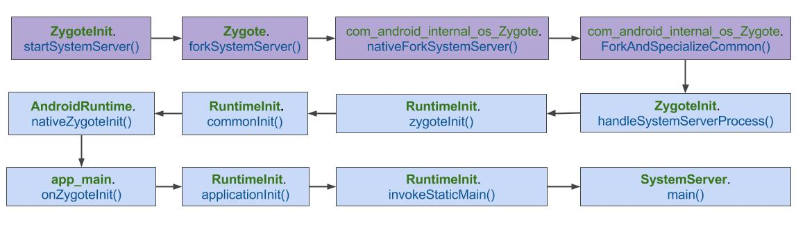

# 1.启动流程

`SystemServer`由`Zygote` fork生成的，进程名为`system_server`，该进程承载着framework的核心服务。




紫色部分运行在`zygote`进程，蓝色运行在`system_server`

## 1.1 startSystemServer
在zygote完成启动的过程。调用下面

```
public static int forkSystemServer(
int uid, int gid, int[] gids, int debugFlags, int[][] rlimits, 
long permittedCapabilities, long effectiveCapabilities){
	VM_HOOKS.preFork();
    // 调用native方法fork system_server进程
    int pid = nativeForkSystemServer(
            uid, gid, gids, debugFlags, 
			rlimit,permittedCapabilities, effectiveCapabilities);
    if (pid == 0) {
        Trace.setTracingEnabled(true);
    }
    VM_HOOKS.postForkCommon();
    return pid;
}
```

```cpp
//com_android_internal_os_Zygote.cpp
static jint com_android_internal_os_Zygote_nativeForkSystemServer(
JNIEnv* env, jclass, uid_t uid, gid_t gid, jintArray gids,
  jint debug_flags, jobjectArray rlimits, jlong permittedCapabilities,
  jlong effectiveCapabilities
){
	//fork子进程
	pid_t pid=ForkAndSpecializeCommon(env,uid,gid,gids,
	debug_flags, rlimits,
                                 		permittedCapabilities, 		effectiveCapabilities,                             		MOUNT_EXTERNAL_DEFAULT, NULL, 		NULL, true, NULL,                         		NULL, NULL);
	if(pid>0){
		//zygote进程，检测system_server进程是否创建
		int status;
		if(waitpid(pid,&status,WNOHANG)==pid){
			//当system_server进程死亡后，重启zygote进程
			kill(getpid(),SIGKILL);
		}
	}
	return pid;
}

static pid_t ForkAndSpecializeCommon(JNIEnv* env, uid_t uid, gid_t gid, jintArray javaGids, jint debug_flags, jobjectArray javaRlimits, jlong permittedCapabilities, 
jlong effectiveCapabilities, jint mount_external, jstring java_se_info, jstring java_se_name, bool is_system_server, jintArray fdsToClose, jstring instructionSet, jstring dataDir){
SetSigChldHandler(); //设置子进程的signal信号处理函数
  pid_t pid = fork(); //fork子进程
  if (pid == 0) {
    //进入子进程
    DetachDescriptors(env, fdsToClose); //关闭并清除文件描述符

    if (!is_system_server) {
        //对于非system_server子进程，则创建进程组
        int rc = createProcessGroup(uid, getpid());
    }
    SetGids(env, javaGids); //设置设置group
    SetRLimits(env, javaRlimits); //设置资源limit

    int rc = setresgid(gid, gid, gid);
    rc = setresuid(uid, uid, uid);

    SetCapabilities(env, permittedCapabilities, effectiveCapabilities);
    SetSchedulerPolicy(env); //设置调度策略

     //selinux上下文
    rc = selinux_android_setcontext(uid, is_system_server, se_info_c_str, se_name_c_str);

    if (se_info_c_str == NULL && is_system_server) {
      se_name_c_str = "system_server";
    }
    if (se_info_c_str != NULL) {
      SetThreadName(se_name_c_str); //设置线程名为system_server，方便调试
    }
    UnsetSigChldHandler(); //设置子进程的signal信号处理函数为默认函数
    //等价于调用zygote.callPostForkChildHooks()
    env->CallStaticVoidMethod(gZygoteClass, gCallPostForkChildHooks, debug_flags,
                              is_system_server ? NULL : instructionSet);
    ...

  } else if (pid > 0) {
    //进入父进程，即zygote进程
  }
  return pid;
}
```

fork()创建进程。到此system_server进程已经创建完成所有工作，接下来开始system_server真正工作。在前面`startSystemServer()`方法中，zygote进程执行完`forkSystemServer()`后，新创建出来的`system_server`进程便进入`handleSystemServerProcess()`方法。

## 1.2 handleSystemServerProcess

```java
//ZygoteInit.java zygoteinit.java中返回执行的

private static void handleSystemServerProcess(ZygoteConnection.Arguments parsedArgs) 
throws ZygoteInit.MethodAndArgsCaller {
	closeServerSocket();//关闭父进程zygote复制而来的socket
	Os.umask(S_IRWXG|S_IRWXO);
	if(parseArgs.niceName!=null){
		Process.setArgv0(parseArgs.niceName);
	}
	if(parseArgs.invokeWith!=null){
		//应用进程
		 WrapperInit.execApplication(parsedArgs.invokeWith,
                    parsedArgs.niceName, parsedArgs.targetSdkVersion,
                    null, parsedArgs.remainingArgs);
	}else{
		//传递剩余参数给systemserver
		//system进程
		RuntimeInit.zygoteInit(parsedArgs.targetSdkVersion, parsedArgs.remainingArgs);
	}
	//should never reach here
}
```
此处`systemServerClasspath`环境变量主要有`/system/framework/`目录下的`services.jar，ethernet-service.jar, wifi-service.jar`这3个文件

# 2. zygoteInit

```java
//RuntimeInit.java
public static final void zygoteInit(int targetSdkVersion, String[] argv, ClassLoader classLoader) 
throws ZygoteInit.MethodAndArgsCaller
{
	redirectLogStreams();//重定向log输出
	commonInit();//通用的一些初始化
	nativeZygoteInit();//zygote初始化
	applicationInit(targetSdkVersion,argv,classLoader);//应用初始化
}
```

## 2.1 redirectLogStreams

```java
//RuntimeInit.java
public static void redirectLogStreams(){
	System.out.close();
	System.setOut(new AndroidPrintStream(Log.INFO,"System.out"));
	System.err.close();
    System.setErr(new AndroidPrintStream(Log.WARN, "System.err"));
}

class AndroidPrintStream extends LoggingPringStream{
	 private final int priority;
    private final String tag;

    /**
     * Constructs a new logging print stream.
     *
     * @param priority from {@link android.util.Log}
     * @param tag to log
     */
    public AndroidPrintStream(int priority, String tag) {
        if (tag == null) {
            throw new NullPointerException("tag");
        }

        this.priority = priority;
        this.tag = tag;
    }

    protected void log(String line) {
        Log.println(priority, tag, line);
    }
	//最终调用
	public static native int println_native(int bufID,
            int priority, String tag, String msg);
}
```

## 2.2commonInit

```
//RuntimeInit.java
private static final void commonInit() {
    // 设置默认的未捕捉异常处理方法
    Thread.setDefaultUncaughtExceptionHandler(new UncaughtHandler());

    // 设置市区，中国时区为"Asia/Shanghai"
    TimezoneGetter.setInstance(new TimezoneGetter() {
        @Override
        public String getId() {
            return SystemProperties.get("persist.sys.timezone");
        }
    });
    TimeZone.setDefault(null);

    //重置log配置
    LogManager.getLogManager().reset();
    new AndroidConfig();

    // 设置默认的HTTP User-agent格式,用于 HttpURLConnection。
    String userAgent = getDefaultUserAgent();
    System.setProperty("http.agent", userAgent);

    // 设置socket的tag，用于网络流量统计
    NetworkManagementSocketTagger.install();
}
```

## 2.3nativeZygoteInit
`nativeZygoteInit()`方法在AndroidRuntime.cpp中，进行了jni映射，对应下面的方法。

```cpp
static void com_android_internal_os_RuntimeInit_nativeZygoteInit(JNIEnv* env, jobject clazz) {
    //此处的gCurRuntime为AppRuntime，是在AndroidRuntime.cpp中定义的
    gCurRuntime->onZygoteInit();
}
virtual void onZygoteInit() {
    sp<ProcessState> proc = ProcessState::self();
    proc->startThreadPool(); //启动新binder线程
}
```

## 2.4 applicationInit

```java
//RuntimeInit.java]
private static void applicationInit(int targetSdkVersion, String[] argv, ClassLoader classLoader) throws ZygoteInit.MethodAndArgsCaller {
    //true代表应用程序退出时不调用AppRuntime.onExit()，否则会在退出前调用
    nativeSetExitWithoutCleanup(true);

    //设置虚拟机的内存利用率参数值为0.75
    VMRuntime.getRuntime().setTargetHeapUtilization(0.75f);
    VMRuntime.getRuntime().setTargetSdkVersion(targetSdkVersion);

    final Arguments args;
    try {
        args = new Arguments(argv); //解析参数
    } catch (IllegalArgumentException ex) {
        return;
    }

    Trace.traceEnd(Trace.TRACE_TAG_ACTIVITY_MANAGER);

    //调用startClass的static方法 main() 【见小节11】
    invokeStaticMain(args.startClass, args.startArgs, classLoader);
}
```
在`startSystemServer()`方法中通过硬编码初始化参数，可知此处`args.startClass`为”com.android.server.SystemServer”。

## 2.5invokeStaticMain

```java
//RuntimeInit.java
private static void invokeStaticMain(String className, String[] argv, ClassLoader classLoader) throws ZygoteInit.MethodAndArgsCaller {
    Class<?> cl = Class.forName(className, true, classLoader);
    ...

    Method m;
    try {
        m = cl.getMethod("main", new Class[] { String[].class });
    } catch (NoSuchMethodException ex) {
        ...
    } catch (SecurityException ex) {
        ...
    }

    int modifiers = m.getModifiers();
    if (! (Modifier.isStatic(modifiers) && Modifier.isPublic(modifiers))) {
        ...
    }

    //通过抛出异常，回到ZygoteInit.main()。这样做好处是能清空栈帧，提高栈帧利用率。【见小节12】
    throw new ZygoteInit.MethodAndArgsCaller(m, argv);
}
```

## 2.6 MethodAndArgsCaller

```java
public static void main(String argv[]) {
    try {
        startSystemServer(abiList, socketName);//启动system_server
        ....
    } catch (MethodAndArgsCaller caller) {
        caller.run(); //【见小节13】
    } catch (RuntimeException ex) {
        closeServerSocket();
        throw ex;
    }
}
```

现在已经很明显了，是`invokeStaticMain()`方法中抛出的异常`MethodAndArgsCaller`，从而进入`caller.run()`方法。

```java
//ZygoteInit.java
public static class MethodAndArgsCaller extends Exception implements Runnable {

    public void run() {
        try {
            //根据传递过来的参数，可知此处通过反射机制调用的是SystemServer.main()方法
            mMethod.invoke(null, new Object[] { mArgs });
        } catch (IllegalAccessException ex) {
            throw new RuntimeException(ex);
        } catch (InvocationTargetException ex) {
            Throwable cause = ex.getCause();
            if (cause instanceof RuntimeException) {
                throw (RuntimeException) cause;
            } else if (cause instanceof Error) {
                throw (Error) cause;
            }
            throw new RuntimeException(ex);
        }
    }
}
```

# 3.启动SystemServer启动

从Zygote一路启动到SystemServer的过程。 简单回顾下，在RuntimeInit.java中invokeStaticMain方法通过创建并抛出异常ZygoteInit.MethodAndArgsCaller，在ZygoteInit.java中的main()方法会捕捉该异常，并调用`caller.run()`，再通过反射便会调用到`SystemServer.main()`方法，该方法主要执行流程：

```
SystemServer.main
    SystemServer.run
        createSystemContext
        startBootstrapServices();
        startCoreServices();
        startOtherServices();
        Looper.loop();
```

## 3.1 SystemServer.main

```java
public final class SystemServer{
	...
	public static void main(String[] args){
		//先初始化对象，再调用run方法
		new SystemServer().run();
	}
}
private void run(){
	//当系统时间比1970年更早，就设置当前系统时间为1970年
	if(System.currentTimeMillis()<EARLIEST_SUPPORTED_TIME){
		 SystemClock.setCurrentTimeMillis(EARLIEST_SUPPORTED_TIME);
	}
	//清除vm内存增长上限，由于启动过程需要较多的虚拟机内存空间
	 VMRuntime.getRuntime().clearGrowthLimit();
	VMRuntime.getRuntime().setTargetHeapUtilization(0.8f);
	Build.ensureFingerprintProperty();
	//确保当前系统进程的binder调用，总是运行在前台优先级(foreground priority)
	BinderInternal.disableBackgroundScheduling(true);
    android.os.Process.setThreadPriority(android.os.Process.THREAD_PRIORITY_FOREGROUND);
    android.os.Process.setCanSelfBackground(false);
	// 主线程looper就在当前线程运行
	Looper.prepareMainLooper();
	//加载android_servers.so库，该库包含的源码在frameworks/base/services/目录下
	System.loadLibrary("android_servers");
	//初始化系统上下文 
	createSystemContext();
	 //创建系统服务管理
	mSystemServiceManager = new SystemServiceManager(mSystemContext);
	//将mSystemServiceManager添加到本地服务的成员sLocalServiceObjects
	LocalServices.addService(SystemServiceManager.class, mSystemServiceManager);
	//启动各种系统服务
	 try {
        startBootstrapServices(); 
        startCoreServices();      
        startOtherServices();   
    } catch (Throwable ex) {
        Slog.e("System", "************ Failure starting system services", ex);
        throw ex;
    }
	 //一直循环执行
    Looper.loop();
    throw new RuntimeException("Main thread loop unexpectedly exited");
}
```

LocalServices通过用静态Map变量sLocalServiceObjects，来保存以服务类名为key，以具体服务对象为value的Map结构。

## 3.2createSystemContext

```
//SystemServer.java
private void createSystemContext(){
	//创建system_server进程的上下文信息
    ActivityThread activityThread = ActivityThread.systemMain();
    mSystemContext = activityThread.getSystemContext();
    //设置主题
    mSystemContext.setTheme(android.R.style.Theme_DeviceDefault_Light_DarkActionBar);
}
```