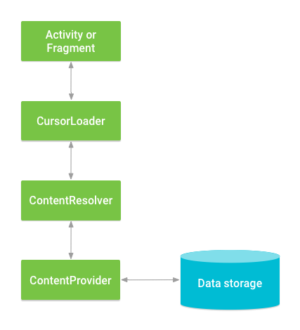

# ContentProvider

* Content Providers将自己的数据安全封装给自己或别的app访问。
* Content providers是一套接口，可连接不同的应用，能够让别的app安全访问和修改你的数据。
* 还有一点好处，content provider进行数据抽象，当你修改自己的数据，比如SQL转到其他数据库，其他app不用去修改。

<!--more-->
**CursorLoader**对象依赖于content provider，能够用来异步查询，并返回结果给UI层。[用CursorLoader来查寻](https://developer.android.com/guide/components/loaders)

# 1.概要
content provider访问数据有很多不同的api。

* 和其他应用共享
* 发送数据给widget
* 通过[SearchRecentSuggestionsProvider](https://developer.android.com/reference/android/content/SearchRecentSuggestionsProvider)返回给应用搜索建议
* 和服务器同步应用数据，使用[AbstractThreadedSyncAdapter](https://developer.android.com/reference/android/content/AbstractThreadedSyncAdapter)
* 在UI中加载数据使用[CursorLoader](https://developer.android.com/reference/android/content/CursorLoader)

# 2.获得一个provider
使用ContentResolver和Content provider进行交互。UI层交互过程应该这样实现：



## 2.1 query数据

```
//查询用户字典和返回结果
mCursor=getContentResolver().query(
UserDictionary.Words.CONTENT_URI,//Uri,相当于FROM table_name，查询表名称
mProjections,//col,col，待查询每行数据对应列数组
mSelectingCluase,//指定选择行的条件
mSelectionArgs,//指定选择行的参数
mSortOrder//返回选择行排序Cursor
);
```
# 3.Conent Uri
外界进程通过URI找到对应的ContentProvider和其中的数据，再进行数据操作
URI分为**系统预置**和**自定义**1，分别对应系统内置的数据（如通讯录、日程表等等）和自定义数据库


```
自定义URI=content://com.ellabrain.provider/User/1
```

* `content://`:主题(schema),Android规定ContentProvider的前缀
* `com.ellabrain.provider`:授权信息(authority),ContentProvider唯一标识
* `User`:表名
* `1`：记录(ID),表中某一个记录(若无指定，则返回全部记录)


使用表中唯一行数据，比如`_ID`是4，可以使用

```
Uri 4thUri=ContentUris.withAppendedId("content://com.ellabrain.provider/User",4);
```

# 4.获取数据query

用下面表进行演示：

|word|app id|frequency|locale|_ID|
|--|--|--|--|--|
|mapreduce|user1|100|en_US|1|
|precompiler|user14|200|fr_FR|2|
|applet|user2|225|fr_CA|3|
|const|user1|255|pt_BR|4|
|int|user5|100|en_UK|5|

获取数据应该有两步：

* 获得provider读权限
* 写查询provider的代码

## 4.1获取读权限

需要在mainfest中用`<uses-permisssion>`标签中声明，声明的内容就是在provider中写的权限的名字，要保证两者一样。

## 4.2写代码query

```java
//a prejection 其中返回行需要的哪些栏目
String[] mProjection={
	UserDictionary.Words._ID,   
    UserDictionary.Words.WORD,   
    UserDictionary.Words.LOCALE
};
String mSelectionClause=null;
//初始化选择参数
String [] mSelectionArgs={""};
```

行获取表达方式被分解成`selection clause`和`selection argumnets`.

* `selection clause`由一个逻辑和布尔表达式，栏目名称，和值。
	* 设置null，则表示符栏目返回所有数据。
	* 如果输入值，形式如`UserDictionary.Words.WORD + " = ?"`从selection arguments中获取，本例子从用户输入获取。
* 如果`selection clause`使用替换参数`?`,参数从`selection arguments`中获取。

```java
String[] mSelectionArgs = {""};
//从UI获取一个单词
mSearchString = mSearchWord.getText().toString();
//检查是否输入是否为空
if(TextUtils.isEmpty(mSearchString)){
	//设置selection clause 为null，将会返回所有单词
	mSelectionCluase=null;
	mSelectionArgs[0]="";
}else{
	mSelectionClasue=UserDictionary.Words.WORD+""= ?;
	mSelectionArgs[0]=mSearchString;
}

//查询用户字典和返回结果
mCursor=getContentResolver().query(
UserDictionary.Words.CONTENT_URI,//Uri,相当于FROM table_name，查询表名称
mProjections,//col,col，待查询每行数据对应列数组
mSelectingCluase,//指定选择行的条件
mSelectionArgs,//指定选择行的参数
mSortOrder//返回选择行排序Cursor
}
if(null==mCursor){
}else if(mCursor.getCount()<1){
}else{
}
```

上面类似于SQL的语句为

```
SELECT _ID, word ,locale FROM words WHERE word = <userinput> ORDER BY word ASC;
```

## 4.3避免恶意输入

使用`?`可避免恶意输入。假如使用如下语句：

```
String mSelectionClause =  "var = " + mUserInput;
```
如果用户输入内从容为`nothing; DROP TABLE *;" `那么将会执行该SQL语句导致删除整个数据。使用`?`不会将输入当成SQL语句来执行，从而得到保护。

## 4.4显示查询结果
查询返回一个`Cursor`对象。用`Cursor`对象可以遍历返回结果的所有行，来得到每栏目数据类型，得到栏目数据，和检查其他结果属性。一些`Cursor`当数据改变自动更新对象，并触发观察方法。

如果没有和选择条件匹配，返回一个`Cursor`对象，但是`Cursor.getCount()`是0.出错的时候返回null，或者抛出Exception。

下面举例说明将`Cursor`展示在`ListView`中.

```
String[] mWordListColumns=
{
	UserDictionary.Words.WORD,
	UserDictionary.Words.LOCALE
};
int[] mWordListItems={R.id.dictWord,R.id.locale};

mCursorAdapter=new SimpleCursorAdapter{
getApplicaitonContext(),
R.layout.worlistrow,
mCursor,
mWordListColumns,
mWordListItems,
0
};
mWordList.setAdapter(mCursorAdapter);
```

## 4.5从查询结果中获取数据

Cursor提供`get`方法获取元素，可以是`getType`，`getString`
```java
//看栏"word"的栏索引
int index=mCursor.getColumnIndex(UserDictionary.Words.WORD);
if(mCursor!=null){
	//在第一次移动之前，行索引为-1.如果第一次不移动会得到exception
	while(mCursor.moveToNext()){
		newWord=mCursor.getString(index);
	}
}else{
}
```

# 5.insert,update和delete数据

## 5.1insert data
插入新行到provider中，返回一个那个行的URI。

```
Uri mNewUri;
//定义一个对象包含插入信息
ContentValue mNewValues=new ContentValues();
mNewValues.put(UserDictionary.Words.APP_ID, "example.user");
mNewValues.put(UserDictionary.Words.LOCALE, "en_US");
mNewValues.put(UserDictionary.Words.WORD, "insert");
mNewValues.put(UserDictionary.Words.FREQUENCY, "100");
mNewUri = getContentResolver().insert(
    UserDictionary.Words.CONTENT_URI,   // the user dictionary content URI
    mNewValues                          // the values to insert
);
```

注意：其中一栏，不要求同一个类型，当然还可以放入`null`使用`ContentValues.putNull()`.
并且不需要添加`_ID`值，因为这个栏自动维护的。

* 返回的mNewUri内容的格式：`content://user_dictionary/words/<id_value>`.其中`<id_value>`是`_ID`中的新行值。
* 从返回的Uri中获得这个值`<id_value>`，可通过`ContentUris.parseId()`

## 5.2update data
更新和插入类似。对selection条件进行约束。下面示例，将`en`改变成`null`。返回的的是更新的行号

```
ContentValue mUpdateValues=new ContentValues();

String mSelectionClause=UserDictionary.Words.LOCALE +  " LIKE ?";
String[] mSelectionArgs = {"en_%"};

int mRowsUpdated=0;
mUpdateValues.putNull(UserDictionary.Words.LOCALE);
mRowsUpdated = getContentResolver().update(
    UserDictionary.Words.CONTENT_URI,   // the user dictionary content URI
    mUpdateValues                       // the columns to update
    mSelectionClause                    // the column to select on
    mSelectionArgs                      // the value to compare to
);
```

## 5.3 delete data
删除和获取类似。具体select的条件。返回被删除的行数。下面举例删除符合"user"的行。

```java
String mSelectionClause=UserDictionary.Words.APP_ID + " LIKE ?";
String[] mSelectionArgs = {"user"};

int mRowsDeleted = 0;
mRowsDeleted = getContentResolver().delete(
    UserDictionary.Words.CONTENT_URI,   // the user dictionary content URI
    mSelectionClause                    // the column to select on
    mSelectionArgs                      // the value to compare to
);
```

# 6.提供的数据类型
providers可以提供很多数据类型如：

* string
* integer
* long integer(long)
* floating point
* long floating point(dobule)

另一个数据类型使用BinaryLargeOBject(BLOB)比如一个64kb数据。
providers还提供MIME数据类型信息。可以使用MIME类型信息看提供的数据，自己应用能否进行处理。获得URI的MIME类型，使用方法`ContentResolver.getType()`.

# 7.获得provider可选形式
对应用开发者，有很重要的三种可选形式：

* Batch access:批量访问。通过`ContentProviderOperation`类获得一个批量访问方法，并且用`ContentResolver.applyBatch()`来应用。
* 异步获取。使用CursorLoader对象。
* [通过intent访问](https://developer.android.com/guide/topics/providers/content-provider-basics#Intents)：不能直接发送给intent，但是可以发送给provider的应用。

## 7.1批量访问
批量访问用来插入很多行，或者在不同表中使用同一个方法行插入。

[ContactsContract.RawContacts](https://developer.android.com/reference/android/provider/ContactsContract.RawContacts)

## 7.2通过一个帮助app显示数据

如果没有获得权限，仍然想要intent显示另一个app的数据。比如日历应用接收一个[ACTION_VIEW]()intent，来显示特定日期和事件。这个允许你显示日期信息，不必自己创建UI。详细见[Calendar Provider](https://developer.android.com/guide/topics/providers/calendar-provider)

你发送intent的应用不必是绑定provider的应用。例如你从一个Contact Provider中获得一个信息，发送一个ACTION_VIEW给一个image viewer，intent中包含contact照片的URI信息。

## 7.3通过intents获得数据
intents能够对contentprovider提供直接权限。

* 可以允许用户这个用户即使没有权限也能获得数据。
* 或者通过一个result intent从一个有权限应用获得
* 获得激活一个有权限的应用让他来为你工作。