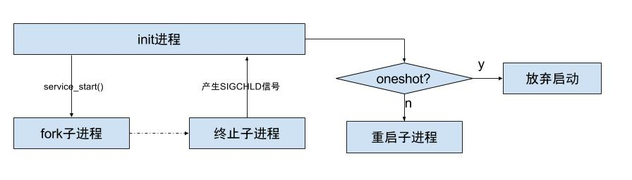

# 1.概述

`init进程`是Linux系统用户空间第一个进程，进程号为1.改进程功能分为4部分：

* 1.分析和运行所有`init.rc`文件.
* 2.生成设备驱动节点（通过rc文件创建）
* 3.处理子进程的终止(signal方式)
* 4.提供属性服务

<!--more-->
## 1.1 main

```cpp
//init.cpp
int main(int argc,char**argv){
	...
	umask(0);//设置文件属性0777
	klog_init();//初始化kernel log,位于设备节点/dev/kmsg
	klog_set_level(KLOG_NOTICE_LEVEL);//设置输出log级别
	//输出init启动阶段的Log
	NOTICE("init%s started\n",is_first_stage?"" : "second stage");
	property_init();//创建一块共享内存空间，用于属性服务
	signal_handler_init();//初始化子进程退出信号处理
	property_load_boot_defaults();//加载default.prop文件
	start_property_service();//启动属性服务器器(通过socket通信)
	init_parse_config_file("/init.rc");
	//执行rc文件中触发器on early_init 语句
	action_for_each_trigger("early-init",action_add_queue_tail);
	//等待设备初始化完成
	queue_buildin_aciton(wait_for_coldboot_done_action,"wit_for_coldboot_done");
	queue_builtin_action(mix_hwrng_into_linux_rng_action, "mix_hwrng_into_linux_rng");
	//设备组合键的初始化操作
	queue_builtin_aciton(keychord_init_aciton,"keychord_init");
	//屏幕上像是Android静态logo
	queue_builtin_action(console_init_action,"console_init");
	//执行rc文件触发器on init 语句
	action_for_each_trigger("init",action_add_queue_tail);
	queue_builtin_action(mix_hwrng_into_linux_rng_action,"mix_hwrng_info_linux_rng_action");
	char bootmode[PROP_VALUE_MAX];
	//当处于充电模式，则charger加入执行队列；否则late-init加入队列。
	if(property_get("ro.bootmode",bootmode)>0&&strcmp(bootmode,"charger")){
		action_for_each_trigger("charger",action_add_queue_tail);
	}else{
		action_for_each_trigger("late-init",action_add_queue_tail);
	}
	//触发器为属性是否设置
	 queue_builtin_action(queue_property_triggers_action, "queue_property_triggers");
	while(true){
		if(!waiting_for_exec){
			execute_one_command();
			restart_processes();
		}
		int timeout=-1;
		if(process_needs_restart){
			timeout=(process_needs_restart-gettime())*1000;
			if(timeout<0)
				timeout=0;
		}
		if(!action_queue_empty()|| cur_action){
			timeout=0;
		}
		epoll_event ev;
		//循环 等待事件发生
		int nr =TEMP_FAILURE_RETRY(epoll_wait(epoll_fd,&ev,1,timeout));
		if(nr==-1){
			ERROR("epoll_wait failed:%s\n",strerror(errno));
		}else if(nr==1){
			((void (*)())ev.data.ptr)();
		}
	}
	return 0;
}
```

## 1.2 log系统

此时android的log系统还没有启动，采用kernel的log系统，打开设备节点`/dev/kmsg`，那么可通过`cat /dev/kmsg`来获取内核Log.

设置log的输出级别为`KLOG_NOTICE_LEVEL(5)`，当log级别小于5时则会输出到kernel log， 默认值为3.

```
#define KLOG_ERROR_LEVEL 3
#define KLOG_WARNING_LEVEL 4
#define KLOG_NOTICE_LEVEL 5
#define KLOG_INFO_LEVEL 6
#define KLOG_DEBUG_LEVEL 7
#define KLOG_DEFAULT_LEVEL 3 //默认为3
```

## 1.3 console_init_action

```
//init.cpp
static int console_init_action(int nargs,char** args){
	char console[PROP_VALUE_MAX];
	if(property_get("ro.boot.console",console)>0){
		snprintf(console_name,sizeof(console_name),"/dev/%s",console);
	}
int fd = open(console_name, O_RDWR | O_CLOEXEC);
    if (fd >= 0)
        have_console = 1;
    close(fd);

    fd = open("/dev/tty0", O_WRONLY | O_CLOEXEC);
    if (fd >= 0) {
        const char *msg;
            msg = "\n"
        "\n"
        "\n"
        "\n"
        "\n"
        "\n"
        "\n"  // console is 40 cols x 30 lines
        "\n"
        "\n"
        "\n"
        "\n"
        "\n"
        "\n"
        "\n"
        " A N D R O I D ";
        write(fd, msg, strlen(msg));
        close(fd);
    }

    return 0;
}
```
这便是开机显示的底部带ANDROID字样的画面。

## 1.4 restart_processes

```
//init.cpp
static void restart_processes(){
	process_need_restart=0;
	service_for_each_flags(SVC_RESTARTING,restart_service_if_needed);
}
```
检查service_list中的所有服务，对于带有`SVC_RESTARTING`标志的服务，则都会调用其相应的`restart_service_if_needed`。

```cpp
//类型内核链表
void service_for_each_flags(unsigned matchFlags,void(*func)(struct service *svc)){
	struct listnode*node;
	struct service*svc;
	list_for_each(node,&serivce_list){
		svc=node_to_item(node,struct service,slist);
		if(svc->flags&matchflags)
			func(svc);
	}
}
static void restart_service_if_needed(struct service*svc){
	time_t next_start_time =svc->time_started+5;
	if(next_start_time<=gettime()){
		svc->flags&=(~SVC_RESTARTING);
		service_start(svc,NULL);
		return;
	}
    if ((next_start_time < 	process_needs_restart) ||
    	(process_needs_restart == 0)) {
    	process_needs_restart = next_start_time;
	}
}
```

# 2.信号处理
通过`signal_handler_init()`来初始化信号处理过程.主要工作：

* 1.初始化signal句柄
* 2.循环处理子进程
* 3.注册epoll句柄
* 4.处理子进程终止

```
void signal_handler_init(){
	int s[2];
	//创建socketpar
	socketpair(AF_UNIX,SOCK_STREAM|SOCK_NONBLOCK|SOCK_CLOEXEC,0,s);
	signal_write_fd=s[0];
	sinal_read_fd=s[1];
	//当捕获信息SIGCHLD,则写入signal_write_fd
	struct sigaciton act;
	act.sa_handler=SIGCHLD_handler;
	//SA_NOCLDSTOP使init进程只有在其子进程终止时收到SIGCHLD信号
	act.sa_flags=SA_NOCLDSTOP;	
	sigaction(SIGCHLD,&act,0);
	reap_any_outstanding_children();
	register_epoll_handler(signal_read_fd,handle_signal);
}
static void SIGCHLD_handler(int){
	//向signal_write_fd写入1，知道成功为止
	if(TEMP_FAILURE_RETRY(signal_write_fd,"1",1)==-1){
	}
}
//读取数据
static void handle_signal(){
	char buf[32];
	//读取signal_read_fd数据，放入buf
	read(signal_read_fd,buf,sizeof(buf));
	reap_any_outstanding_children();
}

```
每个进程在处理其他进程发送的signal信号时都需要先注册，当进程的运行状态改变或终止时会产生某种signal信号，`init进程`是所有用户空间进程的父进程，当其子进程终止时产生`SIGCHLD信号`，init进程调用信号安装函数`sigaction()`，传递参数给sigaction结构体，便完成信号处理的过程。

## 2.1 reap_any_outstanding_children

```cpp
//signal_handler.cpp
static void reap_any_outstanding_children(){
	while(wait_for_one_process()){}
}
static boolean wait_for_one_process(){
	int status;
	//任意子进程，如果子进程没有退出则返回0，否则返回子进程pid
	pid_t pid=TEMP_FAILURE_RETRY(waitpid(-1,&status,WNOHANG));
	if(pid==0){
		return false;
	}else if(pid==-1){
		return false;
	}
	serice* svc=servce_find_by_pid(pid);//根据pid找到service
	std::string name;
	if(!svc)return true;
	//当flag为RESTART不是ONESHORT,先kill进程组内所有子进程或子线程
	if(!(svc->flags& SVC_ONESHOT)||(svc->flags & SVC_RESTART)){
		kill(-pid,SIGKILL);
	}
	//移除当前服务svc中所有创建的socket
	for(socketinfo*si=svc->sockets;si;si=si->next){
		char tmp[128];
		snprintf(tmp,sizeof(tmp),ANDROID_SOCKET_DIR"/%s",si->name);
		unlink(tmp);
	}
	//当flags为EXEC时，释放相应的服务
	if(svc->flags & SVC_EXEC){
		waiting_for_exec=false;
		list_remove(&svc->slist);
		free(svc->name);
		free(svc->);
		return true;
	}
	svc->pid=0;
	svc->flag&=(~SVC_RUNNING);
	
	//对于ONESHOT服务，使其进入disable状态
	if((svc->flags&SVC_ONESHOT)&&!(svc->flags&SVC->RESTART)){
		svc->flags|=SVC_DISABLED;
	}
	//禁用和重置服务，都不再自动重启
	if(svc->flag& (SVC_DISABLE | SVC_RESET)){
		//设置相应的service状态为stopped
		svc->NotifyStateChange("stopped");
		return true;
	}
	//服务4分钟内启动次数超过4次，则重启手机进入recovery模式
	time_t now=gettime();
	if((svc->flags&SVC_CRITICAL)&&!(svc->flags&SVC_RESTART)){
		if(svc->time_crashed+CRITICAL_CRASH_WINDOW>=now){
			if(++svc->nr_crahsed>CRITICAL_CRASH_THRESHOLD){
				android_reboot(ANDROID_RB_RESTART2,0,"recovery");
				return true;
			}
		}else{
			svc->time_crashed=now;
			svc->nr_crashed=1;
		}
	}
	//执行当前service中所有onrestart命令
	struct listnode*node;
	list_for_each(node,&svc->onrestart,commands){
		command* cmd=node_to_item(node,struct command,clist);
		cmd->func(cmd->nargs,cmd->args);
	}
	//设置相应的service状态为restarting
	svc->NotifyStateChange("restarting");
	return true;
}
```
另外：通过`getprop | grep init.svc `可查看所有的service运行状态。状态总共分为：`running`, `stopped`, `restarting`

## 2.2 register_epoll_handler

```cpp
//signal_handler.cpp
void register_epoll_handler(int fd,void (*fn)()){
	epoll_event ev;
	ev.events=EPOLLIN;
	ev.data.ptr=reinterrupt_cast<void*>(fn);
	//将fd可读事件加入到epoll_fd监听队列中
	if(epoll_fd(epoll_fd,EPOLL_CTL_ADD,fd,&ev)==-1){
		ERROR("epoll_ctl failed %s\n",strerror(errno));
	}
}
```

## 2.3 服务重启




当init子进程退出时，会产生SIGCHLD信号，并发送给init进程，通过socket套接字传递数据，调用到`wait_for_one_process()`方法，根据是否是`oneshot`，来决定是重启子进程，还是放弃启动。
所有的Service里面只有`servicemanager` ，`zygote` ，`surfaceflinger`这3个服务有onrestart关键字来触发其他service启动过程。

* `zygote`：触发`media`、`netd`以及子进程(包括system_server进程)重启；
* `system_server`: 触发`zygote`重启;
* `surfaceflinger`：触发zygote重启;
* `servicemanager`: 触发`zygote`、`healthd`、`media`、`surfaceflinger`、`drm`重启

所以`surfaceflinger`,`servicemanager`,`zygote`自身以及`system_server`进程被杀都会触发Zygote重启。

# 3. rc文件语法
rc文件语法是以**行为单位**，以**空格间隔**的语法，以`#`开始代表注释行。rc文件主要包含`Action`、`Service`、`Command`、`Options`，其中对于`Action`和`Service`的名称都是唯一的，**对于重复的命名视为无效**。

## 3.1 Action
Action： 通过`trigger`，即以`on`开头的语句，决定何时执行相应的service。`action_for_each_trigger("early-boot", action_add_queue_tail);`

```
on property:vold.decrypt=trigger_reset_main
    class_reset main
```

* `on early-init`:在初始化早期阶段触发；
* `on init`:在初始化阶段触发；
* `on late-init`:在初始化晚期阶段触发；
* `on boot/charger`： 当系统启动/充电时触发，还包含其他情况，此处不一一列举；
* `on property:<key>=<value>`: 当属性值满足条件时触发；

## 3.2 Service
服务Service，以`service`开头，由init进程启动，一般运行于另外一个`init的子进程`，所以启动service前**需要判断对应的可执行文件是否存在**。init生成的子进程，定义在rc文件，其中每一个service，在启动时会通过`fork方式`生成子进程。

例如： `service servicemanager /system/bin/servicemanager`代表的是服务名为`servicemanager`，服务的路径，也就是服务执行操作时运行`/system/bin/servicemanager`。

## 3.3 Command

* `class_start <service_class_name>`： 启动属于同一个class的所有服务；
* `start <service_name>`： 启动指定的服务，若已启动则跳过；
* `stop <service_name>`： 停止正在运行的服务
* `setprop <name> <value>`：设置属性值
* `mkdir <path>`：创建指定目录
* `symlink <target> <sym_link>`： 创建连接到`<target>`的`<sym_link>`符号链接；
* `write <path> <string>`： 向文件path中写入字符串；
* `exec`： fork并执行，会阻塞init进程直到程序完毕；
* `exprot <name> <name>`：设定环境变量；
* `loglevel <level>`：设置log级别

## 3.4Options

`Options`是`Services`的可选项，与service配合使用

* `disabled`: 不随class自动启动，只有根据service名才启动；
* `oneshot`: service退出后不再重启；
* `user/group`： 设置执行服务的`用户/用户组`，默认都是`root`；
* `class`：设置所属的类名，当所属类启动/退出时，服务也`启动/停止`，默认为default；
* `onrestart`:当服务重启时执行相应命令；
* `socket`: 创建名为`/dev/socket/<name>`的socket
* `critical`: 在规定时间内该service不断重启，则系统会重启并进入恢复模式

**default**: 意味着`disabled=false`，`oneshot=false`，`critical=false`。