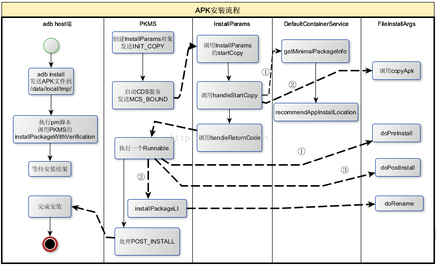

APK的安装及相关处理流程.

<!--more-->

# 1.adb install分析
`adb install`有多个参数，这里仅考虑最简单的，如`adb install frameworktest.apk`。adb是一个命令，install是它的参数。此处直接跳到处理install参数的代码：

```c
//commandline.c
int adb_commandline(int argc, char **argv){
   ...... 
if(!strcmp(argv[0], "install")) {
    ......//调用install_app函数处理
    return install_app(ttype, serial, argc, argv);
}
......
}
int install_app(transport_type transport, char*serial, int argc, char** argv)
{
    //要安装的APK现在还在Host机器上，要先把APK复制到手机中。
   //这里需要设置复制目标的目录，如果安装在内部存储中，则目标目录为/data/local/tmp；
   //如果安装在SD卡上，则目标目录为/sdcard/tmp。
    staticconst char *const DATA_DEST = "/data/local/tmp/%s";
    staticconst char *const SD_DEST = "/sdcard/tmp/%s";
    constchar* where = DATA_DEST;
    charapk_dest[PATH_MAX];
    charverification_dest[PATH_MAX];
    char*apk_file;
    char*verification_file = NULL;
    int file_arg = -1;
    int err;
    int i;
    for (i =1; i < argc; i++) {
        if(*argv[i] != '-') {
           file_arg = i;
           break;
        }else if (!strcmp(argv[i], "-i")) {
            i++;
        }else if (!strcmp(argv[i], "-s")) {
           where = SD_DEST; //-s参数指明该APK安装到SD卡上
        }

    }
    ......
    apk_file= argv[file_arg];
    ......
    //获取目标文件的全路径，如果安装在内部存储中，则目标全路径为/data/local/tmp/安装包名，
    //调用do_sync_push将此APK传送到手机的目标路径
    err =do_sync_push(apk_file, apk_dest, 1 /* verify APK */);
    ...... //1. 4.0新增了一个安装包Verification功能，相关知识稍后分析
    //2.执行pm命令，这个函数很有意思
    pm_command(transport,serial, argc, argv);
......
   cleanup_apk:
   //3.在手机中执行shell rm 命令，删除刚才传送过去的目标APK文件。为什么要删除呢
   delete_file(transport, serial, apk_dest);
   returnerr;
}
```
以上代码中共有三个关键点，分别是：

* 4.0新增了APK安装过程中的Verification的功能。其实就是在安装时，把相关信息发送给指定的`Verification程序`（另外一个APK），由它对要安装的APK进行检查（Verify）。这部分内容在后面分析APK 安装时会介绍。目前，标准代码中还没有从事Verification工作的APK。
* 调用pm_command进行安装，这是一个比较有意思的函数，稍后对其进行分析。
* 安装完后，执行shell rm删除刚才传送给手机的APK文件。为什么会删除呢？因为PKMS在安装过程中会将该APK复制一份到`/data/app`目录下，所以`/data/local/tmp`下的对应文件就可以删除了。这部分代码在后面也能见到。

# 2.pm分析

```c
//commandline.c
static int pm_command(transport_type transport,char* serial,
                      int argc, char** argv){
  char buf[4096];
  snprintf(buf,sizeof(buf), "shell:pm");
  ......//准备参数
  //发送"shell:pm install 参数"给手机端的adbd
  send_shellcommand(transport, serial, buf);
  return 0;
}
```
手机端的adbd在收到客户端发来的shell `pm命令`时会启动一个shell，然后在其中执行pm。
pm实际上是一个脚本，其内容如下：

```
# Script to start "pm" on the device,which has a very rudimentary
# shell.
#
base=/system
export CLASSPATH=$base/frameworks/pm.jar
exec app_process $base/bin com.android.commands.pm.Pm "$@"
```
在编译system.image时，Android.mk中会将该脚本复制到system/bin目录下。从pm脚本的内容来看，它就是通过app_process执行pm.jar包的main函数。分析Zygote时，已经介绍了app_process是一个Native进程，它通过创建虚拟机启动了Zygote，从而转变为一个Java进程。实际上，app_process还可以通过类似的方法（即先创建Dalvik虚拟机，然后执行某个类的main函数）来转变成其他Java程序。

**注意**:Android系统中常用的monkeytest、pm、am等（这些都是脚本文件）都是以这种方式启动的，所以严格地说，app_process才是Android Java进程的老祖宗。

pm.java，app_process执行的就是它定义的main函数，它相当于Java进程的入口函数

```java
//Pm.java
public static void main(String[] args) {
    new Pm().run(args);//创建一个Pm对象，并执行它的run函数
}
//直接分析run函数
public void run(String[] args) {
    boolean validCommand = false;
    ......
    //获取PKMS的binder客户端
    mPm= IPackageManager.Stub.asInterface(ServiceManager.getService("package"))
    ......
    mArgs = args;
    String op = args[0];
    mNextArg = 1;
    ......//处理其他命令，这里仅考虑install的处理
    if("install".equals(op)) {
      runInstall();
      return;
    }
   ......
}
```
接下来分析pm.java的runInstall函数，代码如下：

```java
private void runInstall() {
   int installFlags = 0;
   String installerPackageName = null;
   String opt;
   while ((opt=nextOption()) != null) {
       if (opt.equals("-l")) {
          installFlags |= PackageManager.INSTALL_FORWARD_LOCK;
       } else if (opt.equals("-r")) {
          installFlags |= PackageManager.INSTALL_REPLACE_EXISTING;
       } else if (opt.equals("-i")) {
          installerPackageName = nextOptionData();
          ...... //参数解析
       } ......
  }
  final Uri apkURI;
  final Uri verificationURI;
  final String apkFilePath = nextArg();
  System.err.println("/tpkg: " + apkFilePath);
  if(apkFilePath != null) {
    apkURI = Uri.fromFile(new File(apkFilePath));
  }......
  //获取Verification Package的文件位置
  final String verificationFilePath = nextArg();
  if(verificationFilePath != null) {
    verificationURI = Uri.fromFile(new File(verificationFilePath));
  }else {
    verificationURI = null;
  }
  //创建PackageInstallObserver，用于接收PKMS的安装结果
  PackageInstallObserver obs = new PackageInstallObserver();
  try{
     //1.调用PKMS的installPackageWithVerification完成安装
     mPm.installPackageWithVerification(apkURI, obs,
                                  installFlags,installerPackageName,
                                  verificationURI,null);
    synchronized (obs) {
      while(!obs.finished) {
		 try{
              obs.wait();//等待安装结果
         } ......
      }
      if(obs.result == PackageManager.INSTALL_SUCCEEDED) {
             System.out.println("Success");//安装成功，打印Success
         }......//安装失败，打印失败原因
      } ......
 }
```
Pm解析参数后，最终通过PKMS的Binder客户端调用`installPackageWithVerification`以完成后续的安装工作，所以，下面进入PKMS看看安装到底是怎么一回事。

## 2.1installPackageWithVerification
installPackageWithVerification的代码如下：

```java
//PackageManagerService.java::installPackageWithVerification
public void installPackageWithVerification(UripackageURI,
            IPackageInstallObserverobserver,
           int flags, String installerPackageName, Uri verificationURI,
           ManifestDigest manifestDigest) {
    //检查客户端进程是否具有安装Package的权限。在本例中，该客户端进程是shell
    mContext.enforceCallingOrSelfPermission(
               android.Manifest.permission.INSTALL_PACKAGES,null);
    final int uid = Binder.getCallingUid();
    final int filteredFlags;
    if(uid == Process.SHELL_UID || uid == 0) {
        ......//如果通过shell pm的方式安装，则增加INSTALL_FROM_ADB标志
        filteredFlags = flags | PackageManager.INSTALL_FROM_ADB;
    }else {
           filteredFlags = flags & ~PackageManager.INSTALL_FROM_ADB;
    }
    //创建一个Message，code为INIT_COPY，将该消息发送给之前在PKMS构造函数中
    //创建的mHandler对象，将在另外一个工作线程中处理此消息
    final Message msg = mHandler.obtainMessage(INIT_COPY);
    //创建一个InstallParams，其基类是HandlerParams
    msg.obj = new InstallParams(packageURI, observer,
                   filteredFlags,installerPackageName,
                  verificationURI,manifestDigest);
    mHandler.sendMessage(msg);
}
```
installPackageWithVerification函数倒是蛮清闲，简简单单创建几个对象，然后发送INIT_COPY消息给mHandler，就甩手退出了。根据之前在PKMS构造函数中介绍的知识可知，mHandler被绑定到另外一个工作线程（借助ThreadHandler对象的Looper）中，所以该INIT_COPY消息也将在那个工作线程中进行处理。

## 2.2INIT_COPY处理
INIT_COPY只是安装流程的第一步。

```java
public void handleMessage(Message msg) {
  try {
        doHandleMessage(msg);//调用doHandleMessage函数
  } ......

 }
void doHandleMessage(Message msg) {
 switch(msg.what) {
    caseINIT_COPY: {
      //1.这里记录的是params的基类类型HandlerParams，实际类型为InstallParams
     HandlerParams params = (HandlerParams) msg.obj;
     //idx为当前等待处理的安装请求的个数
     intidx = mPendingInstalls.size();
     if(!mBound) {
        /*很多读者可能想不到，APK的安装居然需要使用另外一个APK提供的服务，该服务就是
         DefaultContainerService，由DefaultCotainerService.apk提供，
         下面的connectToService函数将调用bindService来启动该服务*/
        if(!connectToService()) {
             return;
        }else {//如果已经连上，则以idx为索引，将params保存到mPendingInstalls中
           mPendingInstalls.add(idx, params);
        }
     } else {
           mPendingInstalls.add(idx, params);
           if(idx == 0) {
             //如果安装请求队列之前的状态为空，则表明要启动安装
             mHandler.sendEmptyMessage(MCS_BOUND);
           }

     }
     break;
}
......//后续再分析
```
这里假设之前已经成功启动了DefaultContainerService（以后简称DCS），并且idx为零，所以这是PKMS首次处理安装请求，也就是说，下一个将要处理的是MCS_BOUND消息。

**注意**connectToService在调用bindService时会传递一个DefaultContainerConnection类型的对象，以接收服务启动的结果。当该服务成功启动后，此对象的onServiceConnected被调用，其内部也将发送`MCS_BOUND消息`给mHandler。

## 2.3MCS_BOUND
安装请求的状态从INIT_COPY变成MCS_BOUND了,依然在doHandleMessage函数中，直接从对应的case开始，代码如下：

```java
......//接doHandleMesage中的switch/case
case MCS_BOUND: {
  if(msg.obj != null) {
     mContainerService= (IMediaContainerService) msg.obj;
  }
  if(mContainerService == null) {
    ......//如果没法启动该service，则不能安装程序
     mPendingInstalls.clear();
  } else if(mPendingInstalls.size() > 0) {
     HandlerParamsparams = mPendingInstalls.get(0);
     if(params != null) {
        //调用params对象的startCopy函数，该函数由基类HandlerParams定义
        if(params.startCopy()) {
           ......
            if(mPendingInstalls.size() > 0) {
               mPendingInstalls.remove(0);//删除队列头
             }
            if (mPendingInstalls.size() == 0) {
            	if (mBound) {
               	......//如果安装请求都处理完了，则需要和Service断绝联系,
              	//通过发送MSC_UNB消息处理断交请求。读者可自行研究此情况的处理流程
               	removeMessages(MCS_UNBIND);
               	Message ubmsg = obtainMessage(MCS_UNBIND);
               	sendMessageDelayed(ubmsg, 10000);
            	}
        	}else {
              //如果还有未处理的请求，则继续发送MCS_BOUND消息。
              //为什么不通过一个循环来处理所有请求呢
              mHandler.sendEmptyMessage(MCS_BOUND);
            }
       }

   } ......
   break;
```
MCS_BOUND的处理还算简单，就是调用HandlerParams的startCopy函数。

**HandlerParams和InstallArgs介绍**
除了HandlerParams家族外，这里提前请出另外一个家族InstallArgs及其成员


* HandlerParams和InstallArgs均为抽象类。
* HandlerParams有三个子类，分别是InstallParams、MoveParams和MeasureParams。
	* `InstallParams`用于处理APK的安装
	* `MoveParams`用于处理某个已安装APK的搬家请求（例如从内部存储移动到SD卡上）
	* `MeasureParams`用于查询某个已安装的APK占据存储空间的大小（例如在设置程序中得到的某个APK使用的缓存文件的大小）。

* 对于InstallParams来说，它还有两个伴儿，即InstallArgs的派生类FileInstallArgs和SdInstallArgs。
	* `FileInstallArgs`针对的是安装在内部存储的APK
	* `SdInstallArgs`针对的是那些安装在SD卡上的APK。

将讨论用于内部存储安装的FileInstallArgs。在前面MCS_BOUND的处理中，首先调用InstallParams的startCopy函数，该函数由其基类HandlerParams实现，代码如下：

```java
//[-->PackageManagerService.java::HandlerParams.startCopy函数]
final boolean startCopy() {
    boolean res;
    try {
    		//MAX_RETIRES目前为4，表示尝试4次安装，如果还不成功，则认为安装失败
    		if(++mRetries > MAX_RETRIES) {
        	mHandler.sendEmptyMessage(MCS_GIVE_UP);
        	handleServiceError();
        	return false;
    	} else {
         	handleStartCopy();//1.调用派生类的handleStartCopy函数
         	res= true;
    	}
   } ......
   handleReturnCode();//2.调用派生类的handleReturnCode，返回处理结果
   return res;

}
```
基类的startCopy将调用子类实现的handleStartCopy和handleReturnCode函数。下面来看InstallParams是如何实现这两个函数的。

**InstallParams分析**
先来看派生类InstallParams的handleStartCopy函数，代码如下：

```java
//[-->PackageManagerService::InstallParams.handleStartCopy]
public void handleStartCopy() throwsRemoteException {
    int ret= PackageManager.INSTALL_SUCCEEDED;
    finalboolean fwdLocked = //不考虑fwdLocked的情况
        (flags &PackageManager.INSTALL_FORWARD_LOCK) != 0;
    //根据adb install的参数，判断安装位置
    finalboolean onSd = (flags & PackageManager.INSTALL_EXTERNAL) != 0;
    finalboolean onInt = (flags & PackageManager.INSTALL_INTERNAL) != 0;
    PackageInfoLite pkgLite = null;
    if(onInt && onSd) {
        //APK不能同时安装在内部存储和SD卡上
       ret =PackageManager.INSTALL_FAILED_INVALID_INSTALL_LOCATION;
    } elseif (fwdLocked && onSd) {
      //fwdLocked的应用不能安装在SD卡上
      ret =PackageManager.INSTALL_FAILED_INVALID_INSTALL_LOCATION;
    } else {
       finallong lowThreshold;
       //获取DeviceStorageMonitorService的binder客户端
       finalDeviceStorageMonitorService dsm =                           
             (DeviceStorageMonitorService) ServiceManager.getService(
                                  DeviceStorageMonitorService.SERVICE);
       if(dsm == null) {
         lowThreshold = 0L;
       }else {
         //从DSMS查询内部空间最小余量，默认是总空间的10%
         lowThreshold = dsm.getMemoryLowThreshold();
     }
     try {
        //授权DefContainerService URI读权限
        mContext.grantUriPermission(DEFAULT_CONTAINER_PACKAGE,
                  packageURI,Intent.FLAG_GRANT_READ_URI_PERMISSION);
       //1.调用DCS的getMinimalPackageInfo函数，得到一个PackageLite对象
       pkgLite =mContainerService.getMinimalPackageInfo(packageURI,
                                   flags,lowThreshold);
     }finally ......//撤销URI授权
    	//PacakgeLite的recommendedInstallLocation成员变量保存该APK推荐的安装路径
   		int loc =pkgLite.recommendedInstallLocation;
   		if (loc== PackageHelper.RECOMMEND_FAILED_INVALID_LOCATION) {
         ret= PackageManager.INSTALL_FAILED_INVALID_INSTALL_LOCATION;

   } else if......{
   } else {
       //2.根据DCS返回的安装路径，还需要调用installLocationPolicy进行检查
       loc =installLocationPolicy(pkgLite, flags);
       if(!onSd && !onInt) {
          if(loc == PackageHelper.RECOMMEND_INSTALL_EXTERNAL) {
              flags |= PackageManager.INSTALL_EXTERNAL;
              flags &=~PackageManager.INSTALL_INTERNAL;
           } ......//处理安装位置为内部存储的情况
        }
   }

   }

   //3.创建一个安装参数对象，对于安装位置为内部存储的情况，args的真实类型为FileInstallArgs
   final InstallArgs args = createInstallArgs(this);
   mArgs =args;
   if (ret== PackageManager.INSTALL_SUCCEEDED) {
        final int requiredUid = mRequiredVerifierPackage == null ? -1
                      :getPackageUid(mRequiredVerifierPackage);
        if(requiredUid != -1 && isVerificationEnabled()) {
            ......//④待会再讨论verification的处理
        }else {
         //5.调用args的copyApk函数
         ret= args.copyApk(mContainerService, true);
      }
   }
   mRet =ret;//确定返回值
}
```
在以上代码中，一共列出了五个关键点，总结如下：
* 调用DCS的`getMinimalPackageInfo`函数，将得到一个`PackageLite`对象，该对象是一个轻量级的用于描述APK的结构（相比PackageParser.Package来说）。在这段代码逻辑中，主要想取得其recommendedInstallLocation的值。此值表示该APK推荐的安装路径。
* 调用installLocationPolicy检查推荐的安装路径。例如`系统Package不允许安装在SD卡上`。
* createInstallArgs将根据安装位置创建不同的InstallArgs。如果是内部存储，则返回FileInstallArgs，否则为SdInstallArgs。
* 在正式安装前，应先对该APK进行必要的检查。这部分代码后续再介绍。
* 调用InstallArgs的copyApk。对本例来说，将调用FileInstallArgs的copyApk函数。
下面围绕这五个基本关键点展开分析，其中installLocationPolicy和createInstallArgs比较简单

(1) DefaultContainerService分析
首先分析DCS的getMinimalPackageInfo函数，其代码如下：

```java
//[-->DefaultContainerService.java::getMinimalPackageInfo函数]
public PackageInfoLite getMinimalPackageInfo(finalUri fileUri, int flags,
                                                      longthreshold) {
  //注意该函数的参数：fileUri指向该APK的文件路径（此时还在/data/local/tmp下）
  PackageInfoLite ret = new PackageInfoLite();
  ......
  String scheme = fileUri.getScheme();
  ......
  String archiveFilePath = fileUri.getPath();
  DisplayMetrics metrics = new DisplayMetrics();
  metrics.setToDefaults();
  //调用PackageParser的parsePackageLite解析该APK文件
  PackageParser.PackageLite pkg =
         PackageParser.parsePackageLite(archiveFilePath,0);
  if (pkg== null) {//解析失败
   ......//设置错误值
  	return ret;
  }
  ret.packageName = pkg.packageName;
  ret.installLocation = pkg.installLocation;
  ret.verifiers = pkg.verifiers;
  //调用recommendAppInstallLocation，取得一个合理的安装位置
  ret.recommendedInstallLocation =
          recommendAppInstallLocation(pkg.installLocation,archiveFilePath,
                                          flags, threshold);
   return ret;
}
```
**APK可在AndroidManifest.xml中声明一个安装位置**，不过DCS除了解析该位置外，还需要做进一步检查，这个工作由recommendAppInstallLocation函数完成，代码如下：

```java
//[-->DefaultContainerService.java::recommendAppInstallLocation函数]
private int recommendAppInstallLocation(intinstallLocation,
                               StringarchiveFilePath, int flags,long threshold) {
 int prefer;
 booleancheckBoth = false;
 check_inner: {
   if((flags & PackageManager.INSTALL_FORWARD_LOCK) != 0) {
        prefer = PREFER_INTERNAL;
        break check_inner; //根据FOWRAD_LOCK的情况，只能安装在内部存储
    } else if ((flags & PackageManager.INSTALL_INTERNAL) != 0) {
        prefer = PREFER_INTERNAL;
        break check_inner;
   }
   ......//检查各种情况
  } else if(installLocation == PackageInfo.INSTALL_LOCATION_AUTO) {
     prefer= PREFER_INTERNAL;//一般设定的位置为AUTO，默认是内部空间
     checkBoth = true; //设置checkBoth为true
     breakcheck_inner;
 }
  //查询settings数据库中的secure表，获取用户设置的安装路径
  intinstallPreference =
        Settings.System.getInt(getApplicationContext()
            .getContentResolver(),
             Settings.Secure.DEFAULT_INSTALL_LOCATION,
             PackageHelper.APP_INSTALL_AUTO);
   if(installPreference == PackageHelper.APP_INSTALL_INTERNAL) {
       prefer = PREFER_INTERNAL;
       break check_inner;
   } else if(installPreference == PackageHelper.APP_INSTALL_EXTERNAL) {
      prefer= PREFER_EXTERNAL;
      breakcheck_inner;
   }
   prefer =PREFER_INTERNAL;
 }
  //判断外部存储空间是否为模拟的，这部分内容我们以后再介绍
  finalboolean emulated = Environment.isExternalStorageEmulated();
  final FileapkFile = new File(archiveFilePath);
  booleanfitsOnInternal = false;
  if(checkBoth || prefer == PREFER_INTERNAL) {
      try {//检查内部存储空间是否足够大
         fitsOnInternal = isUnderInternalThreshold(apkFile, threshold);
      } ......
  }
  booleanfitsOnSd = false;
  if(!emulated && (checkBoth || prefer == PREFER_EXTERNAL)) {
      try{ //检查外部存储空间是否足够大
         fitsOnSd = isUnderExternalThreshold(apkFile);
       } ......
  }
  if (prefer== PREFER_INTERNAL) {
      if(fitsOnInternal) {//返回推荐安装路径为内部空间
        return PackageHelper.RECOMMEND_INSTALL_INTERNAL;
      }
 } else if (!emulated && prefer == PREFER_EXTERNAL) {
      if(fitsOnSd) {//返回推荐安装路径为外部空间
        return PackageHelper.RECOMMEND_INSTALL_EXTERNAL;
     }
 }
if(checkBoth) {
   if(fitsOnInternal) {//如果内部存储满足条件，先返回内部空间
       return PackageHelper.RECOMMEND_INSTALL_INTERNAL;
   }else if (!emulated && fitsOnSd) {
         return PackageHelper.RECOMMEND_INSTALL_EXTERNAL;
   }
}
...... //到此，前几个条件都不满足，此处将根据情况返回一个明确的错误值
     return PackageHelper.RECOMMEND_FAILED_INSUFFICIENT_STORAGE;
}
}
```
DCS的getMinimalPackageInfo函数为了得到一个推荐的安装路径做了不少工作，其中，各种安装策略交叉影响。这里总结一下相关的知识点：

* APK在AndroidManifest.xml中设置的安装点默认为AUTO，在具体对应时倾向内部空间。
* 用户在Settings数据库中设置的安装位置。
* 检查外部存储或内部存储是否有足够空间。

(2)InstallArgs的copyApk函数分析
至此，我们已经得到了一个合适的安装位置（先略过Verification这一步）。下一步工作就由copyApk来完成。根据函数名可知该函数将完成APK文件的复制工作，此中会有蹊跷吗？来看下面的代码。

```java
//[-->PackageManagerService.java::InstallArgs.copyApk函数]
int copyApk(IMediaContainerService imcs, booleantemp) throws RemoteException {
   if (temp){
    /*本例中temp参数为true，createCopyFile将在/data/app下创建一个临时文件。
    临时文件名为vmdl-随机数.tmp。为什么会用这样的文件名呢？
    因为PKMS通过Linux的inotify机制监控了/data/app,目录，如果新复制生成的文件名后缀
    为apk，将触发PKMS扫描。为了防止发生这种情况，这里复制生成的文件才有了
    如此奇怪的名字
  */
   createCopyFile();
  }
   FilecodeFile = new File(codeFileName);
   ......
   ParcelFileDescriptor out = null;
   try {
     out =ParcelFileDescriptor.open(codeFile,
                            ParcelFileDescriptor.MODE_READ_WRITE);
     }......
     int ret= PackageManager.INSTALL_FAILED_INSUFFICIENT_STORAGE;
     try {
       mContext.grantUriPermission(DEFAULT_CONTAINER_PACKAGE,
                   packageURI,Intent.FLAG_GRANT_READ_URI_PERMISSION);
       //调用DCS的copyResource，该函数将执行复制操作，最终结果是/data/local/tmp
       //下的APK文件被复制到/data/app下，文件名也被换成vmdl-随机数.tmp
       ret= imcs.copyResource(packageURI, out);
    }finally {
      ......//关闭out，撤销URI授权
  }
    return ret;
}
```
关于临时文件，这里提供一个示例


`/data/app`下有两个文件，第一个是正常的APK文件，第二个是`createCopyFile`生成的临时文件。

## 2.4handleReturnCode分析
在HandlerParams的startCopy函数中，handleStartCopy执行完之后，将调用handleReturnCode开展后续工作

```java
//[-->PackageManagerService.java::InstallParams.HandleParams]
void handleReturnCode() {
    if(mArgs != null) {
        //调用processPendingInstall函数，mArgs指向之前创建的FileInstallArgs对象
        processPendingInstall(mArgs, mRet);
    }
}
private void processPendingInstall(finalInstallArgs args,
                                  final intcurrentStatus) {
  //向mHandler中抛一个Runnable对象
  mHandler.post(new Runnable() {
       public void run() {
        mHandler.removeCallbacks(this);
        //创建一个PackageInstalledInfo对象，
        PackageInstalledInfo res = new PackageInstalledInfo();
        res.returnCode = currentStatus;
        res.uid = -1;
        res.pkg = null;
        res.removedInfo = new PackageRemovedInfo();
        if(res.returnCode == PackageManager.INSTALL_SUCCEEDED) {
           //1.调用FileInstallArgs的doPreInstall
           args.doPreInstall(res.returnCode);
           synchronized (mInstallLock) {
               //2.调用installPackageLI进行安装
               installPackageLI(args, true, res);
           }
          //3.调用FileInstallArgs的doPostInstall
          args.doPostInstall(res.returnCode);
        }
       final boolean update = res.removedInfo.removedPackage != null;
       boolean doRestore = (!update&& res.pkg != null &&
                    res.pkg.applicationInfo.backupAgentName!= null);
       int token;//计算一个ID号
        if(mNextInstallToken < 0) mNextInstallToken = 1;
            token = mNextInstallToken++;
            //创建一个PostInstallData对象
            PostInstallData data = new PostInstallData(args, res);
           //保存到mRunningInstalls结构中，以token为key
           mRunningInstalls.put(token, data);
           if (res.returnCode ==PackageManager.INSTALL_SUCCEEDED && doRestore)
           {
                  ......//备份恢复的情况暂时不考虑
           }
           if(!doRestore) {
            //5.抛一个POST_INSTALL消息给mHandler进行处理
            Message msg = mHandler.obtainMessage(POST_INSTALL, token, 0);
            mHandler.sendMessage(msg);
           }
        }
   });
}
```
由上面代码可知，handleReturnCode主要做了4件事情：

* 调用InstallArgs的doPreInstall函数，在本例中是FileInstallArgs的doPreInstall函数。
* 调用PKMS的installPackageLI函数进行APK安装，该函数内部将调用InstallArgs的doRename对临时文件进行改名。另外，还需要扫描此APK文件。此过程和之前介绍的“扫描系统Package”一节的内容类似。至此，该APK中的私有财产就全部被登记到PKMS内部进行保存了。
* 调用InstallArgs的doPostInstall函数，在本例中是FileInstallArgs的doPostInstall函数。
* 此时，该APK已经安装完成（不论失败还是成功），继续向mHandler抛送一个`POST_INSTALL`消息，该消息携带一个token，通过它可从mRunningInstalls数组中取得一个PostInstallData对象。
**提示**对于FileInstallArgs来说，其doPreInstall和doPostInstall都比较简单

这里介绍一下FileInstallArgs的doRename函数，它的功能是将临时文件改名，最终的文件的名称一般为“包名-数字.apk”。其中，数字是一个index，从1开始。`/data/app`目录下第一个文件的文件名。

## 2.4 POST_INSTALL处理
现在需要处理POST_INSTALL消息，因为adb install还等着安装结果.

```java
//[-->PackageManagerService.java::doHandleMessage函数]
......//接前面的switch/case
case POST_INSTALL: {
  PostInstallData data = mRunningInstalls.get(msg.arg1);
  mRunningInstalls.delete(msg.arg1);
  booleandeleteOld = false;
  if (data!= null) {
      InstallArgs args = data.args;
      PackageInstalledInfo res = data.res;
      if(res.returnCode == PackageManager.INSTALL_SUCCEEDED) {
           res.removedInfo.sendBroadcast(false, true);
           Bundle extras = new Bundle(1);
           extras.putInt(Intent.EXTRA_UID, res.uid);
           final boolean update = res.removedInfo.removedPackage != null;
           if (update) {
                extras.putBoolean(Intent.EXTRA_REPLACING, true);
           }
           //发送PACKAGE_ADDED广播
           sendPackageBroadcast(Intent.ACTION_PACKAGE_ADDED,
                    res.pkg.applicationInfo.packageName,extras, null, null);
           if (update) {
            /*
            如果是APK升级，那么发送PACKAGE_REPLACE和MY_PACKAGE_REPLACED广播。
            二者不同之处在于PACKAGE_REPLACE将携带一个extra信息
            */
      }
      Runtime.getRuntime().gc();
      if(deleteOld) {
         synchronized (mInstallLock) {
          //调用FileInstallArgs的doPostDeleteLI进行资源清理
          res.removedInfo.args.doPostDeleteLI(true);
         }
      }
      if(args.observer != null) {
      try {
        // 向pm通知安装的结果
        args.observer.packageInstalled(res.name, res.returnCode);
      } ......
  }
break;
```

# 3.APK 安装流程总结

没想到APK的安装流程竟然如此复杂，其目的无非**是让APK中的私人财产公有化**。相比之下，在PKMS构造函数中进行公有化改造就非常简单。另外，如果考虑安装到SD卡的处理流程，那么APK的安装将会更加复杂。

这里要总结APK安装过程中的几个重要步骤


列出以下内容：

* 安装APK到内部存储空间这一工作流程涉及的主要对象包括：PKMS、DCS、InstallParams和FileInstallArgs。
* 此工作流程中每个对象涉及到的关键函数。
* 对象之间的调用通过虚线表达，调用顺序通过①②③等标明。

